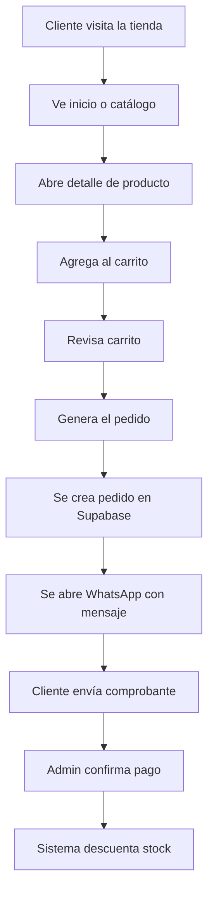
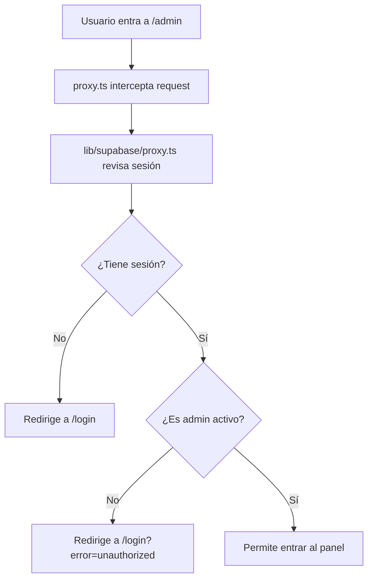
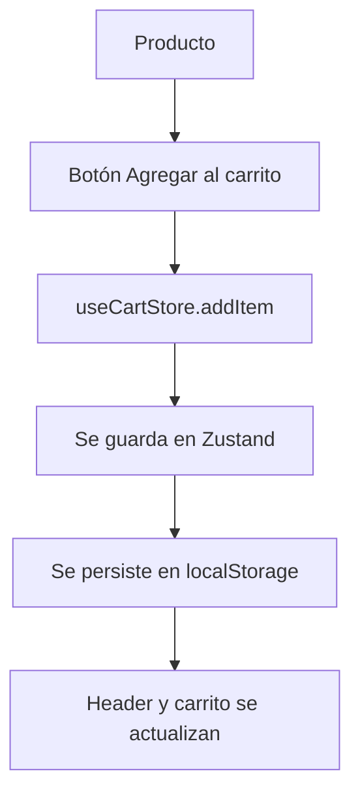
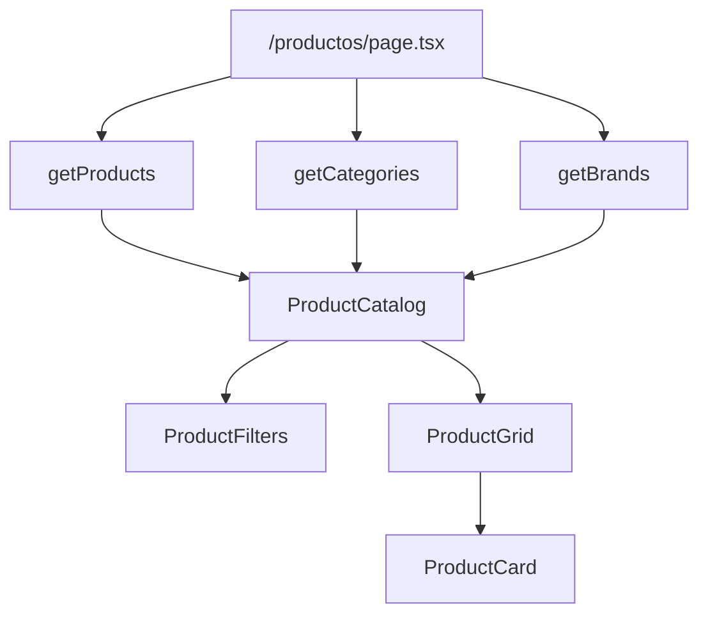
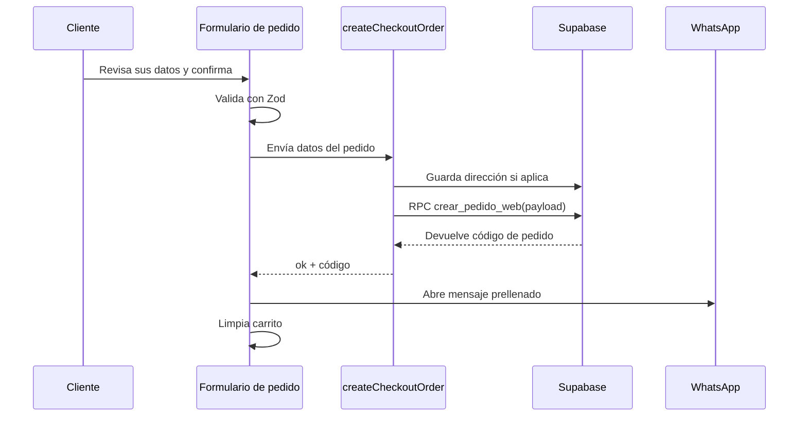
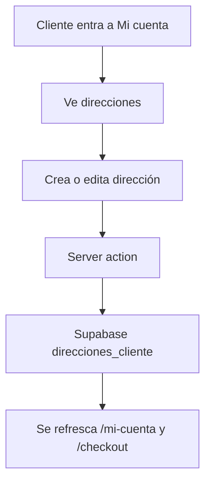
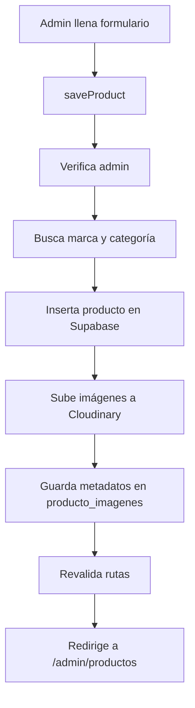
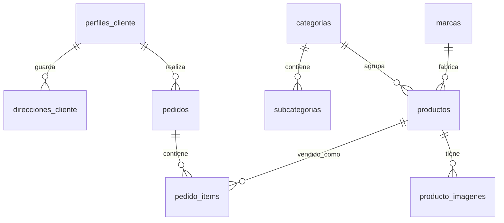
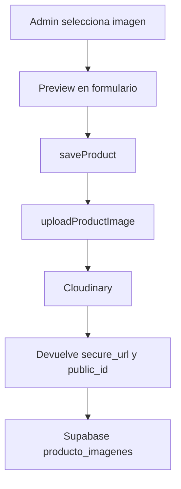

# Documentación del proyecto Pesca Con Fe

Esta guía explica el proyecto desde cero. La idea es que una persona principiante pueda leerla y entender qué hace el sitio, cómo está organizado, cómo se conectan las pantallas, cómo funcionan los formularios, cómo se usa Supabase, cómo se suben imágenes con Cloudinary y qué papel cumple cada carpeta importante.

> Nota: este documento describe el estado actual del código. Los archivos del proyecto usan nombres en español en muchas partes, por ejemplo `formulario-checkout.tsx`, `tienda-carrito.ts`, `datos-negocio.ts` y `acciones.ts`.

## Tabla de contenidos

1. [Qué es este proyecto](#1-qué-es-este-proyecto)
2. [Tecnologías usadas](#2-tecnologías-usadas)
3. [Cómo leer este proyecto si eres principiante](#3-cómo-leer-este-proyecto-si-eres-principiante)
4. [Estructura general de carpetas](#4-estructura-general-de-carpetas)
5. [Cómo funciona Next.js en este proyecto](#5-cómo-funciona-nextjs-en-este-proyecto)
6. [Rutas y páginas principales](#6-rutas-y-páginas-principales)
7. [Componentes principales](#7-componentes-principales)
8. [Estado del carrito](#8-estado-del-carrito)
9. [Catálogo y detalle de producto](#9-catálogo-y-detalle-de-producto)
10. [Generación de pedidos](#10-generación-de-pedidos)
11. [Autenticación, perfil y direcciones](#11-autenticación-perfil-y-direcciones)
12. [Panel administrador](#12-panel-administrador)
13. [Supabase y base de datos](#13-supabase-y-base-de-datos)
14. [Cloudinary e imágenes de productos](#14-cloudinary-e-imágenes-de-productos)
15. [SEO, sitemap, robots y JSON-LD](#15-seo-sitemap-robots-y-json-ld)
16. [Variables de entorno](#16-variables-de-entorno)
17. [Rendimiento y navegación rápida](#17-rendimiento-y-navegación-rápida)
18. [Comandos de desarrollo](#18-comandos-de-desarrollo)
19. [Glosario para principiantes](#19-glosario-para-principiantes)

## 1. Qué es este proyecto

Pesca Con Fe es un ecommerce para una tienda de artículos de pesca en Shushufindi, Ecuador. El sitio permite que una persona vea productos, filtre el catálogo, consulte preguntas frecuentes, agregue productos al carrito, genere un pedido, elija envío o retiro en local y envíe el comprobante por WhatsApp.

También tiene un panel administrador para gestionar productos, marcas, pedidos, estados de pedidos e imágenes.

En palabras simples:

- El cliente entra al sitio.
- Revisa productos.
- Agrega productos al carrito.
- Inicia sesión y revisa el formulario para generar el pedido.
- El sistema crea un pedido en Supabase.
- Se abre WhatsApp con un mensaje listo para enviar.
- El administrador revisa el pedido y confirma el pago.
- Al confirmar el pago se descuenta stock.

Flujo general:



## 2. Tecnologías usadas

El proyecto usa varias herramientas. No todas hacen lo mismo, así que conviene separarlas por responsabilidad.

| Tecnología | Para qué sirve |
| --- | --- |
| Next.js 16 | Framework principal del sitio. Maneja rutas, páginas, render en servidor y build. |
| React 19 | Biblioteca para construir interfaces con componentes. |
| TypeScript | JavaScript con tipos. Ayuda a detectar errores antes de ejecutar. |
| Tailwind CSS | Sistema de clases CSS para estilos rápidos y consistentes. |
| Supabase | Autenticación, base de datos, RLS y funciones RPC. |
| Cloudinary | Almacenamiento y entrega de imágenes de productos. |
| Zustand | Estado global del carrito en el navegador. |
| React Hook Form | Manejo de formularios. |
| Zod | Validación de datos del formulario de pedido. |
| Lucide React | Iconos. |
| Framer Motion | Animaciones suaves. |
| Sonner | Notificaciones tipo toast. |

La aplicación no es solo frontend estático. Tiene partes que corren en el servidor, como las consultas a Supabase y las server actions que crean pedidos o actualizan productos.

## 3. Cómo leer este proyecto si eres principiante

Una buena forma de entenderlo es seguir el camino de un usuario:

1. Inicio: `src/app/page.tsx`
2. Catálogo: `src/app/productos/page.tsx`
3. Detalle: `src/app/productos/[slug]/page.tsx`
4. Carrito: `src/store/tienda-carrito.ts` y `src/components/cart/*`
5. Generación del pedido: `src/components/checkout/formulario-checkout.tsx`
6. Pedido en base de datos: `src/app/checkout/acciones.ts`
7. Panel admin: `src/app/admin/*`

También ayuda separar mentalmente dos mundos:

- **Servidor**: lee y escribe en Supabase, protege secretos, arma datos antes de renderizar.
- **Cliente/navegador**: maneja clics, formularios interactivos, carrito en `localStorage` y estados visuales.

Ejemplo simple:

```tsx
"use client";
```

Cuando un archivo tiene esa línea arriba, significa que ese componente corre en el navegador y puede usar estado, eventos como `onClick`, `useEffect`, `localStorage`, etc.

Cuando no tiene `"use client"`, normalmente es un Server Component de Next.js y puede leer datos en el servidor.

## 4. Estructura general de carpetas

Vista resumida:

```txt
proyecto-pescaconfe/
  src/
    app/
    components/
    data/
    hooks/
    lib/
    store/
    types/
    proxy.ts
  public/
    images/
  package.json
  next.config.ts
  tsconfig.json
```

### `src/app`

Contiene las rutas del sitio. En Next.js App Router, las carpetas dentro de `app` representan URLs.

Ejemplos:

| Archivo | Ruta que representa |
| --- | --- |
| `src/app/page.tsx` | `/` |
| `src/app/productos/page.tsx` | `/productos` |
| `src/app/productos/[slug]/page.tsx` | `/productos/algun-producto` |
| `src/app/checkout/page.tsx` | `/checkout` |
| `src/app/preguntas-frecuentes/page.tsx` | `/preguntas-frecuentes` |
| `src/app/admin/page.tsx` | `/admin` |

Los archivos `acciones.ts` dentro de algunas carpetas contienen server actions. Es decir, funciones que corren en el servidor y pueden escribir en Supabase.

### `src/components`

Contiene piezas reutilizables de interfaz.

Ejemplos:

- `components/layout/header.tsx`: cabecera pública estática.
- `components/layout/controles-header-cliente.tsx`: controles interactivos del header, como usuario, carrito y menú móvil.
- `components/layout/footer.tsx`: pie de página.
- `components/products/tarjeta-producto.tsx`: tarjeta individual de producto.
- `components/checkout/formulario-checkout.tsx`: formulario para generar pedidos.
- `components/faq/formulario-pregunta.tsx`: consulta autenticada por WhatsApp.
- `components/admin/formulario-producto.tsx`: formulario para crear o editar productos.

### `src/lib`

Contiene lógica reutilizable que no es directamente UI.

Ejemplos:

- `lib/supabase/data.ts`: funciones para leer datos desde Supabase, incluyendo lecturas públicas cacheadas.
- `lib/supabase/publico.ts`: crea cliente Supabase anónimo para lecturas públicas sin cookies.
- `lib/sesion-publica.ts`: avisa al header cuando login o logout cambian la sesión visible.
- `lib/supabase/server.ts`: crea cliente Supabase para servidor.
- `lib/supabase/client.ts`: crea cliente Supabase para navegador.
- `lib/cloudinary.ts`: sube y elimina imágenes en Cloudinary.
- `lib/envio.ts`: calcula costos de envío.
- `lib/whatsapp.ts`: arma mensajes para WhatsApp.
- `lib/ecuador.ts`: valida cédula ecuatoriana.

### `src/store`

Contiene estado global. Actualmente el archivo principal es:

- `store/tienda-carrito.ts`

Ahí vive el carrito del cliente. Usa Zustand y persiste los productos en el navegador.

### `src/types`

Contiene los modelos TypeScript del proyecto.

Ejemplos:

- `types/producto.ts`: producto, categoría, imagen.
- `types/pedido.ts`: pedido, estado, item de pedido.
- `types/cliente.ts`: perfil y dirección del cliente.
- `types/negocio.ts`: configuración del negocio y cuentas bancarias.
- `types/usuario.ts`: resumen de usuario público.

### `src/data`

Contiene datos locales que no dependen de Supabase.

Archivos principales:

- `data/datos-negocio.ts`
- `data/preguntas-frecuentes.ts`

Incluye:

- nombre del negocio,
- redes sociales,
- dirección,
- cuentas bancarias,
- categorías visuales,
- logos de marcas.
- preguntas y respuestas públicas.

### `public`

Contiene archivos públicos como imágenes. Todo lo que está en `public` se puede referenciar desde el sitio con una ruta que empieza con `/`.

Ejemplo:

```tsx
<Image src="/images/logos/logo-negro-nuevo.webp" alt="Pesca Con Fe" />
```

## 5. Cómo funciona Next.js en este proyecto

Este proyecto usa Next.js App Router. Eso significa que las rutas se definen por carpetas y archivos especiales.

### `page.tsx`

Un `page.tsx` crea una página visible.

Ejemplo:

```txt
src/app/productos/page.tsx
```

Eso crea la ruta:

```txt
/productos
```

### `layout.tsx`

Un `layout.tsx` envuelve páginas.

Ejemplos:

- `src/app/layout.tsx`: layout raíz de todo el sitio.
- `src/app/admin/layout.tsx`: layout solo del panel admin.

El layout raíz define:

- idioma del documento,
- fuentes,
- metadata base,
- datos estructurados del negocio,
- sistema de notificaciones.

El layout admin define:

- sidebar administrativo,
- área principal del panel.

### `proxy.ts`

`src/proxy.ts` usa `updateSession` de Supabase para proteger rutas admin.

Flujo:



### Server Components

Por defecto, las páginas de Next.js son Server Components. Eso permite hacer cosas como:

```tsx
const products = await getProducts();
```

Esto ocurre en el servidor, antes de enviar la página al navegador.

### Client Components

Cuando un archivo necesita interactividad, usa:

```tsx
"use client";
```

Ejemplos:

- carrito,
- filtros de productos,
- formulario de checkout,
- formulario de producto,
- login,
- botones con eventos.

### Shell público rápido

Las páginas públicas usan `PublicShell` para mostrar header, contenido y footer. Ese shell no lee cookies ni consulta la sesión del usuario, porque hacerlo convertiría páginas como inicio, catálogo, contacto o carrito en páginas dinámicas.

El header se divide en dos partes:

- `header.tsx`: logo y navegación principal, renderizados como contenido estático.
- `controles-header-cliente.tsx`: usuario, login, carrito y menú móvil, hidratados en el navegador.

Para saber si hay usuario autenticado, los controles del header llaman a:

```txt
src/app/api/sesion/route.ts
```

Así la navegación pública puede cargarse rápido y, al mismo tiempo, el header sigue mostrando login, cuenta, admin o carrito según corresponda. Cuando el usuario inicia o cierra sesión, `lib/sesion-publica.ts` avisa a esos controles para refrescar el estado visible sin esperar una recarga manual.

### Estados de carga

Algunas rutas tienen un archivo `loading.tsx`. Ese archivo muestra un esqueleto visual mientras Next.js prepara la página real.

Ejemplos:

- `src/app/productos/loading.tsx`
- `src/app/productos/[slug]/loading.tsx`
- `src/app/checkout/loading.tsx`
- `src/app/mi-cuenta/loading.tsx`
- `src/app/admin/loading.tsx`

Esto no cambia la lógica de compra. Solo evita que una navegación lenta parezca congelada.

## 6. Rutas y páginas principales

### Rutas públicas

| Ruta | Archivo | Qué hace |
| --- | --- | --- |
| `/` | `src/app/page.tsx` | Página de inicio. Carga categorías y productos destacados. |
| `/productos` | `src/app/productos/page.tsx` | Catálogo con filtros. |
| `/productos/[slug]` | `src/app/productos/[slug]/page.tsx` | Detalle de un producto. |
| `/carrito` | `src/app/carrito/page.tsx` | Página del carrito. |
| `/checkout` | `src/app/checkout/page.tsx` | Formulario para crear pedido. |
| `/login` | `src/app/login/page.tsx` | Login y registro. |
| `/mi-cuenta` | `src/app/mi-cuenta/page.tsx` | Perfil, direcciones y pedidos del cliente. |
| `/quienes-somos` | `src/app/quienes-somos/page.tsx` | Historia e información institucional. |
| `/preguntas-frecuentes` | `src/app/preguntas-frecuentes/page.tsx` | Respuestas públicas y consulta autenticada por WhatsApp. |
| `/contacto` | `src/app/contacto/page.tsx` | Información de contacto, redes y mapa. |

### Rutas admin

| Ruta | Archivo | Qué hace |
| --- | --- | --- |
| `/admin` | `src/app/admin/page.tsx` | Dashboard con métricas y pedidos recientes. |
| `/admin/productos` | `src/app/admin/productos/page.tsx` | Lista y gestión de productos. |
| `/admin/productos/nuevo` | `src/app/admin/productos/nuevo/page.tsx` | Crear producto. |
| `/admin/productos/[id]/editar` | `src/app/admin/productos/[id]/editar/page.tsx` | Editar producto existente. |
| `/admin/marcas` | `src/app/admin/marcas/page.tsx` | Crear y editar marcas. |
| `/admin/pedidos` | `src/app/admin/pedidos/page.tsx` | Ver pedidos y cambiar estados. |

## 7. Componentes principales

Los componentes son bloques reutilizables. En lugar de escribir todo en una sola página enorme, el proyecto divide la UI en piezas.

### Layout

| Archivo | Responsabilidad |
| --- | --- |
| `components/layout/header.tsx` | Navegación pública estática. |
| `components/layout/controles-header-cliente.tsx` | Usuario, login, carrito y menú móvil del header. |
| `components/layout/footer.tsx` | Pie de página, redes, contacto y enlaces. |
| `components/layout/contenedor-publico.tsx` | Envuelve páginas públicas con header y footer sin leer cookies. |

### Inicio

| Archivo | Responsabilidad |
| --- | --- |
| `seccion-principal.tsx` | Hero de la página inicial. |
| `tarjeta-categoria.tsx` | Tarjeta para navegar a una categoría. |
| `franja-marcas.tsx` | Muestra logos de marcas. |
| `seccion-beneficios.tsx` | Beneficios de compra. |
| `seccion-noticias-instagram.tsx` | Widget de Instagram/noticias. |

### Productos

| Archivo | Responsabilidad |
| --- | --- |
| `catalogo-productos.tsx` | Coordina filtros, orden y vista del catálogo. |
| `filtros-productos.tsx` | Campos para filtrar productos. |
| `cuadricula-productos.tsx` | Organiza tarjetas en una grilla. |
| `tarjeta-producto.tsx` | Muestra producto individual. |
| `galeria-producto.tsx` | Galería de imágenes en detalle. |
| `acciones-detalle-producto.tsx` | Cantidad y botón de agregar al carrito. |

### Carrito

| Archivo | Responsabilidad |
| --- | --- |
| `panel-carrito.tsx` | Drawer lateral del carrito. |
| `pagina-carrito-cliente.tsx` | Vista principal del carrito. |
| `item-carrito.tsx` | Línea de producto del carrito. |
| `resumen-carrito.tsx` | Subtotal, envío y total. |

### Formulario de pedido

| Archivo | Responsabilidad |
| --- | --- |
| `formulario-checkout.tsx` | Formulario principal de pedido. |
| `tarjeta-cuenta-bancaria.tsx` | Cuenta bancaria seleccionable. |

### Preguntas frecuentes

| Archivo | Responsabilidad |
| --- | --- |
| `app/preguntas-frecuentes/page.tsx` | Página pública con respuestas desplegables. |
| `data/preguntas-frecuentes.ts` | Contenido local; no crea tablas ni registros en Supabase. |
| `faq/formulario-pregunta.tsx` | Conserva temporalmente la consulta y exige sesión antes de abrir WhatsApp. |

### Panel admin

| Archivo | Responsabilidad |
| --- | --- |
| `barra-lateral-admin.tsx` | Navegación admin. |
| `tarjeta-metrica-admin.tsx` | Métricas del dashboard. |
| `tabla-productos-admin.tsx` | Tabla y acciones de productos. |
| `tabla-pedidos-admin.tsx` | Tabla, detalle y acciones de pedidos. |
| `formulario-producto.tsx` | Crear o editar productos. |
| `formulario-marca.tsx` | Crear marcas. |

## 8. Estado del carrito

El carrito vive en:

```txt
src/store/tienda-carrito.ts
```

Usa Zustand. Zustand permite crear una "tienda" de estado global. En este caso, la tienda guarda:

- productos agregados,
- cantidad por producto,
- subtotal,
- envío,
- total,
- número de items.

La tienda se persiste con `persist`, por eso el carrito se conserva si el usuario recarga la página.

Ejemplo simplificado:

```ts
export const useCartStore = create<CartState>()(
  persist(
    (set, get) => ({
      items: [],
      addItem: (product, quantity = 1) => { ... },
      clearCart: () => set({ items: [] }),
    }),
    { name: "pesca-con-fe-cart" },
  ),
);
```

Esto significa:

- `items` empieza vacío.
- `addItem` agrega productos.
- `clearCart` vacía el carrito.
- `name: "pesca-con-fe-cart"` es la clave en `localStorage`.

### Flujo del carrito



### Cálculo de envío

El costo se calcula en:

```txt
src/lib/envio.ts
```

Regla principal:

- cañas: $8.50,
- carretes y otros: $6.50,
- si hay varios productos, se cobra la tarifa más alta,
- si el cliente retira en local, el envío cuesta $0.

## 9. Catálogo y detalle de producto

La página de catálogo está en:

```txt
src/app/productos/page.tsx
```

Esa página carga:

- productos,
- categorías,
- marcas.

Esas lecturas públicas se hacen desde `src/lib/supabase/data.ts` con caché de Next.js. Para no depender de cookies, usan el cliente anónimo de:

```txt
src/lib/supabase/publico.ts
```

Cuando el admin cambia productos o marcas, las server actions invalidan esa caché para que el catálogo público se actualice.

Luego se los pasa a:

```txt
src/components/products/catalogo-productos.tsx
```

El catálogo filtra por:

- búsqueda,
- categoría,
- subcategoría,
- marca,
- disponibilidad,
- precio máximo,
- orden.

Si la URL incluye una categoría, por ejemplo:

```txt
/productos?categoria=canas
```

el componente `ProductCatalog` lee ese parámetro en el navegador y arranca filtrado. Esto evita que toda la página de catálogo tenga que renderizarse dinámicamente en el servidor.

Flujo:



### Detalle del producto

La ruta:

```txt
/productos/[slug]
```

usa:

```txt
src/app/productos/[slug]/page.tsx
```

El `[slug]` representa una parte dinámica de la URL.

Ejemplo:

```txt
/productos/carrete-penn-battle
```

El código busca el producto por slug:

```ts
const product = await getProductBySlug(slug);
```

Si no existe, Next muestra `notFound()`.

Los productos activos también se pasan a `generateStaticParams()`. Eso permite que Next.js prerenderice las páginas de detalle conocidas y las sirva más rápido. Los productos relacionados se consultan directamente por categoría para no recargar todo el catálogo varias veces.

El detalle muestra:

- galería,
- precio,
- stock,
- descripción,
- características,
- video de YouTube si existe,
- productos relacionados,
- datos estructurados para SEO.

## 10. Generación de pedidos

La pantalla para generar pedidos es uno de los flujos más importantes. Su ruta técnica sigue siendo `/checkout`.

Archivos principales:

| Archivo | Función |
| --- | --- |
| `src/app/checkout/page.tsx` | Carga datos iniciales y renderiza el formulario de pedido. |
| `src/components/checkout/formulario-checkout.tsx` | Maneja el formulario. |
| `src/app/checkout/acciones.ts` | Crea el pedido en Supabase. |
| `src/lib/whatsapp.ts` | Arma el mensaje para WhatsApp. |

### Qué hace el formulario

1. Comprueba que exista una sesión y un perfil completo.
2. Lee el carrito desde Zustand y muestra la identidad bloqueada del perfil.
3. Permite elegir envío o retiro y usar una dirección guardada o temporal.
4. Permite seleccionar cuenta bancaria.
5. Valida datos con Zod.
6. Llama a una server action.
7. La server action crea el pedido en Supabase.
8. Se abre WhatsApp con un mensaje prellenado.
9. Se limpia el carrito.

Flujo completo:



### Validación con Zod

En `formulario-checkout.tsx` se define `checkoutSchema`.

Ejemplo simplificado:

```ts
const checkoutSchema = z.object({
  fullName: z.string().min(3),
  cedula: z.string().refine(isValidEcuadorianCedula),
  phone: z.string().min(9),
  deliveryType: z.enum(["envio_servientrega", "retiro_local"]),
});
```

Zod revisa que los datos tengan sentido antes de crear el pedido.

Además, si el cliente elige envío por Servientrega, se exigen:

- provincia,
- ciudad,
- dirección,
- celular de contacto.

Si elige retiro local, esos datos no son obligatorios.

### Server action del formulario de pedido

Está en:

```txt
src/app/checkout/acciones.ts
```

Función principal:

```ts
createCheckoutOrder(input)
```

Esta función:

- crea cliente Supabase del servidor,
- exige un usuario autenticado y un perfil completo,
- guarda dirección si el cliente pidió guardarla,
- arma un `payload`,
- llama a la función RPC `crear_pedido_web`,
- devuelve el código del pedido.

### Por qué se usa RPC

RPC significa "Remote Procedure Call". En Supabase es una función de PostgreSQL que se puede llamar desde el código.

En este proyecto se usa:

```ts
supabase.rpc("crear_pedido_web", { payload })
```

Ventajas:

- centraliza la creación del pedido,
- permite guardar pedido e items de forma más controlada,
- exige un cliente autenticado con perfil completo,
- evita repartir demasiada lógica crítica en el frontend.

## 11. Autenticación, perfil y direcciones

La autenticación se hace con Supabase Auth.

Archivos principales:

| Archivo | Función |
| --- | --- |
| `components/shared/panel-inicio-sesion.tsx` | Login y registro. |
| `app/auth/acciones.ts` | Logout. |
| `app/mi-cuenta/page.tsx` | Página de cuenta. |
| `app/mi-cuenta/acciones.ts` | Acciones de perfil y direcciones. |
| `lib/usuario.ts` | Mapea datos de usuario y direcciones. |

### Login y registro

El panel de login:

- permite iniciar sesión,
- permite registrarse,
- muestra mensajes de error claros,
- explica si la redirección se debe a que el cliente intentó generar un pedido o enviar una pregunta,
- conserva el destino durante login, registro y confirmación de correo,
- usa Supabase desde el navegador.

La pregunta pendiente se guarda temporalmente en `sessionStorage` y se restaura al volver a `/preguntas-frecuentes`. No se almacena en Supabase.

Ejemplo conceptual:

```ts
const supabase = createClient();
await supabase.auth.signInWithPassword({ email, password });
```

### Perfil del cliente

El perfil se guarda en:

```txt
perfiles_cliente
```

La acción:

```ts
updateProfile()
```

hace dos cosas:

1. Actualiza metadatos del usuario en Supabase Auth.
2. Inserta o actualiza la fila en `perfiles_cliente`.

### Direcciones

Las direcciones se guardan en:

```txt
direcciones_cliente
```

Funciones principales:

| Función | Qué hace |
| --- | --- |
| `saveCustomerAddress` | Crea o actualiza dirección. |
| `setPrimaryCustomerAddress` | Marca una dirección como principal. |
| `deactivateCustomerAddress` | Desactiva una dirección sin borrarla físicamente. |

Flujo:



## 12. Panel administrador

El panel admin vive bajo:

```txt
src/app/admin
```

Está protegido por `proxy.ts` y Supabase. Solo usuarios con fila activa en `perfiles_admin` pueden entrar.

### Dashboard

Archivo:

```txt
src/app/admin/page.tsx
```

Muestra:

- total de productos,
- pedidos,
- métricas de ventas,
- bajo stock,
- pedidos recientes.

### Productos

Archivos:

```txt
src/app/admin/productos/page.tsx
src/components/admin/tabla-productos-admin.tsx
src/components/admin/formulario-producto.tsx
src/app/admin/productos/acciones.ts
```

Acciones de productos:

| Función | Qué hace |
| --- | --- |
| `saveProduct` | Crea o actualiza producto. |
| `toggleProductActive` | Activa o desactiva producto. |
| `deleteProduct` | Desactiva producto para ocultarlo del catálogo. |
| `setMainImage` | Marca una imagen como principal. |
| `deleteProductImage` | Desactiva una imagen. |

### Crear o editar producto

El formulario permite editar:

- nombre,
- slug,
- SKU,
- marca,
- categoría,
- subcategoría,
- precio,
- stock,
- descripción,
- características,
- video de YouTube,
- activo/inactivo,
- destacado,
- imágenes.

El botón principal muestra `Creando producto...` o `Guardando cambios...` y permanece deshabilitado mientras la Server Action termina. Esto evita clics repetidos y envíos duplicados.

Las acciones `setMainImage` y `deleteProductImage` se ejecutan desde botones independientes que no envían ni reinician el formulario completo. Después actualizan la ruta de edición, el catálogo y el detalle público.

Flujo de creación:



### Marcas

Archivos:

```txt
src/app/admin/marcas/page.tsx
src/components/admin/formulario-marca.tsx
src/app/admin/marcas/acciones.ts
```

Permite:

- crear marca,
- editar marca,
- activar/desactivar marca.

### Pedidos

Archivos:

```txt
src/app/admin/pedidos/page.tsx
src/components/admin/tabla-pedidos-admin.tsx
src/app/admin/pedidos/acciones.ts
```

Funciones de estado:

| Función | Qué hace |
| --- | --- |
| `confirmOrderPayment` | Confirma pago. |
| `markOrderReadyForPickup` | Marca listo para retiro. |
| `markOrderPickedUp` | Marca retirado. |
| `markOrderShipped` | Marca enviado. |
| `cancelOrder` | Cancela pedido. |

Estas funciones llaman RPCs de Supabase que cambian estados y, cuando corresponde, actualizan inventario.

## 13. Supabase y base de datos

Supabase se usa para:

- autenticación,
- perfiles de cliente,
- direcciones,
- catálogo,
- marcas,
- categorías,
- productos,
- imágenes de productos,
- pedidos,
- items de pedido,
- permisos admin.

### Clientes Supabase

Hay dos clientes:

| Archivo | Dónde se usa |
| --- | --- |
| `lib/supabase/server.ts` | Servidor, pages, server actions. |
| `lib/supabase/client.ts` | Navegador, login/registro. |

### Lectura de datos

El archivo más importante de lectura es:

```txt
src/lib/supabase/data.ts
```

Contiene funciones como:

| Función | Qué lee |
| --- | --- |
| `getProducts` | Productos públicos e imágenes. |
| `getProductBySlug` | Un producto por URL. |
| `getRelatedProducts` | Productos relacionados. |
| `getCategories` | Categorías y subcategorías. |
| `getBrands` | Marcas activas. |
| `getAdminProducts` | Productos para admin. |
| `getAdminOrders` | Pedidos para admin. |
| `getCustomerOrders` | Pedidos del cliente. |

### Tablas principales

| Tabla | Para qué sirve |
| --- | --- |
| `perfiles_admin` | Decide qué usuarios pueden entrar al admin. |
| `perfiles_cliente` | Datos personales del cliente. |
| `direcciones_cliente` | Direcciones guardadas. |
| `categorias` | Categorías del catálogo. |
| `subcategorias` | Subcategorías dentro de categorías. |
| `marcas` | Marcas de productos. |
| `productos` | Productos vendibles. |
| `producto_imagenes` | Imágenes subidas a Cloudinary. |
| `pedidos` | Pedidos creados desde el formulario autenticado. |
| `pedido_items` | Productos dentro de cada pedido. |

### Vistas principales

| Vista | Uso |
| --- | --- |
| `productos_publicos` | Home, catálogo y detalle. |
| `productos_admin` | Resumen administrativo. |
| `pedidos_admin` | Pedidos para panel admin. |
| `mis_pedidos` | Pedidos del cliente autenticado. |

### RLS explicado simple

RLS significa Row Level Security. Es una forma de decirle a Supabase:

"Aunque alguien intente consultar esta tabla, solo puede ver o modificar filas permitidas".

Ejemplos:

- Un cliente solo puede ver sus direcciones.
- Un cliente solo puede ver sus pedidos.
- Un admin activo puede gestionar productos.
- El público puede ver productos activos.

### Relación entre tablas



### Datos locales vs datos en Supabase

No todo vive en Supabase.

Vive en código:

- nombre del negocio,
- redes sociales,
- cuentas bancarias,
- imágenes visuales de categorías,
- logos de marcas,
- textos comerciales.
- preguntas frecuentes.

Vive en Supabase:

- productos,
- marcas,
- categorías,
- pedidos,
- clientes,
- direcciones,
- imágenes de productos como metadatos,
- stock.

## 14. Cloudinary e imágenes de productos

Cloudinary almacena las imágenes reales. Supabase guarda información sobre esas imágenes.

Archivo:

```txt
src/lib/cloudinary.ts
```

Funciones:

| Función | Qué hace |
| --- | --- |
| `getCloudinaryClient` | Configura cliente Cloudinary. |
| `uploadProductImage` | Sube imagen. |
| `deleteCloudinaryImage` | Elimina imagen por `publicId`. |

Cuando el admin sube imágenes:

1. El formulario recibe archivos.
2. Se muestran previews locales.
3. Al guardar, la server action sube imágenes a Cloudinary.
4. Cloudinary devuelve URL, public ID, tamaño, formato, etc.
5. Esa información se guarda en `producto_imagenes`.

Las imágenes ya guardadas pueden marcarse como principal o desactivarse sin enviar el formulario del producto. Estas acciones verifican nuevamente que el usuario sea administrador y reciben de forma explícita el producto y la imagen seleccionada.

Flujo:



Variables necesarias:

```txt
CLOUDINARY_CLOUD_NAME=
CLOUDINARY_API_KEY=
CLOUDINARY_API_SECRET=
```

Importante: `CLOUDINARY_API_SECRET` nunca debe exponerse en componentes cliente.

## 15. SEO, sitemap, robots y JSON-LD

El proyecto incluye varias piezas para SEO.

| Archivo | Función |
| --- | --- |
| `src/app/sitemap.ts` | Genera sitemap. |
| `src/app/robots.ts` | Reglas para rastreadores. |
| `components/shared/producto-json-ld.tsx` | Datos estructurados de producto. |
| `components/shared/negocio-local-json-ld.tsx` | Datos estructurados del negocio. |

JSON-LD es una forma de entregar datos estructurados a buscadores. Ayuda a que Google entienda que una página representa un producto, negocio local, precio, disponibilidad, etc.

Ejemplo conceptual:

```tsx
<script
  type="application/ld+json"
  dangerouslySetInnerHTML={{ __html: JSON.stringify(data) }}
/>
```

## 16. Variables de entorno

El proyecto usa `.env.local` para variables locales.

### Supabase

```txt
NEXT_PUBLIC_SUPABASE_URL=
NEXT_PUBLIC_SUPABASE_PUBLISHABLE_KEY=
```

Estas variables empiezan con `NEXT_PUBLIC_`, por eso pueden usarse también desde el navegador.

### Cloudinary

```txt
CLOUDINARY_CLOUD_NAME=
CLOUDINARY_API_KEY=
CLOUDINARY_API_SECRET=
```

Estas variables no deben empezar con `NEXT_PUBLIC_` porque son privadas y solo deben usarse en servidor.

### URL del sitio

```txt
NEXT_PUBLIC_SITE_URL=
```

Se usa para sitemap, SEO y datos estructurados.

## 17. Rendimiento y navegación rápida

La tienda pública intenta servir la mayor cantidad posible de contenido como HTML estático o cacheado. Esto ayuda a que los clics entre páginas se sientan más rápidos.

Puntos importantes:

- Las rutas públicas como `/`, `/productos`, `/carrito`, `/contacto` y `/quienes-somos` no deben leer cookies directamente.
- El estado de sesión del header se consulta aparte desde `/api/sesion`.
- Los datos públicos de productos, categorías y marcas usan caché con tags.
- Los detalles de producto usan `generateStaticParams()` para prerenderizar productos activos.
- Las rutas con trabajo dinámico muestran `loading.tsx` mientras cargan.

Cuando un admin cambia productos o marcas, las acciones llaman `updateTag()` y `revalidatePath()` para refrescar la tienda pública.

Comandos útiles para revisar rendimiento:

```bash
pnpm build
```

La tabla final indica si una ruta es estática (`○`), dinámica (`ƒ`) o SSG (`●`).

```bash
pnpm next build --debug
```

Ayuda a detectar si una ruta se volvió dinámica por usar cookies, `searchParams` u otro dato de request.

## 18. Comandos de desarrollo

Instalar dependencias:

```bash
pnpm install
```

Levantar servidor local:

```bash
pnpm dev
```

Normalmente abre:

```txt
http://localhost:3000
```

Revisar lint:

```bash
pnpm lint
```

Crear build de producción:

```bash
pnpm build
```

Iniciar build ya generado:

```bash
pnpm start
```

## 19. Glosario para principiantes

### Componente

Una pieza reutilizable de UI. Por ejemplo, una tarjeta de producto o un botón.

### Props

Datos que se pasan a un componente.

Ejemplo:

```tsx
<ProductCard product={product} />
```

Aquí `product` es una prop.

### Estado

Información que cambia mientras la app está abierta. Ejemplo: productos en el carrito.

### Hook

Función especial de React para usar estado o comportamiento. Ejemplo: `useState`, `useEffect`, `useCartStore`.

### Server Component

Componente que corre en el servidor. Puede leer datos antes de enviar HTML al navegador.

### Client Component

Componente que corre en el navegador. Usa `"use client"` y puede manejar clics, formularios, `localStorage`, etc.

### Server Action

Función que corre en el servidor y puede hacer cambios en la base de datos.

### Supabase

Plataforma que ofrece base de datos PostgreSQL, autenticación, permisos y funciones.

### RLS

Row Level Security. Reglas de seguridad por fila en Supabase.

### RPC

Función de base de datos que se llama desde el código, por ejemplo `crear_pedido_web`.

### Slug

Texto seguro para URL. Ejemplo:

```txt
carrete-penn-battle
```

### SEO

Optimización para buscadores.

### JSON-LD

Formato para entregar datos estructurados a buscadores.

### Revalidate

En Next.js, refrescar datos de una ruta después de cambiar información en la base.

Ejemplo:

```ts
revalidatePath("/productos");
```

### Cache

Guardar temporalmente el resultado de una consulta para no repetir el mismo trabajo en cada visita.

### Tag de caché

Etiqueta que se pone a datos cacheados. En este proyecto se usan tags como `products` y `brands` para refrescar la tienda cuando el admin cambia información.

### `updateTag`

Función de Next.js usada en Server Actions para expirar inmediatamente datos cacheados por tag.

### `loading.tsx`

Archivo especial de Next.js que muestra una interfaz temporal mientras una ruta termina de cargar.

### LocalStorage

Almacenamiento del navegador. En este proyecto se usa para conservar el carrito.

## Cierre

Este proyecto combina tienda pública, carrito, generación de pedidos, preguntas frecuentes, cuenta de cliente, panel administrador, Supabase y Cloudinary. La lógica más importante se puede entender siguiendo estos caminos:

1. Cliente compra: catálogo -> carrito -> inicio de sesión -> pedido -> WhatsApp.
2. Cliente gestiona cuenta: login -> mi cuenta -> perfil/direcciones/pedidos.
3. Visitante consulta: preguntas frecuentes -> inicio de sesión si desea preguntar -> WhatsApp.
4. Admin gestiona tienda: admin -> productos/marcas/pedidos -> Supabase/Cloudinary.

Si se entiende esa estructura, el resto del proyecto se vuelve mucho más fácil de leer.
