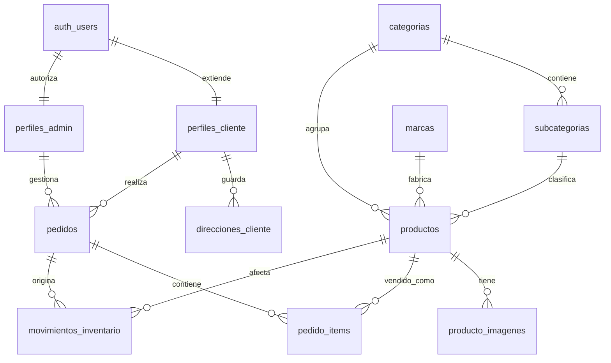

# Modelo de Base de Datos - Supabase + Cloudinary

Este documento describe el modelo relacional actual de Pesca Con Fe para operar el ecommerce con Supabase Auth, panel administrador, perfiles de cliente, direcciones, checkout persistente, productos administrables y multiples imagenes en Cloudinary.

El modelo esta simplificado: los datos puramente visuales o de frontend, como configuracion del negocio, redes sociales, textos de marca, cuentas bancarias visibles en checkout, imagenes de categorias y ordenes manuales de catalogo, viven en el codigo de la app y no en Supabase.

## Principios Del Modelo

- Supabase Auth guarda la identidad del usuario.
- `perfiles_admin` decide quien puede entrar al panel administrador.
- `perfiles_cliente` guarda datos de cliente para autocompletar checkout.
- `direcciones_cliente` guarda direcciones reutilizables para usuarios autenticados.
- La tienda publica lee catalogo, marcas, categorias, subcategorias, productos e imagenes activas.
- Las imagenes de productos viven en Cloudinary; la base guarda metadatos, URLs y `public_id`.
- Un producto puede tener multiples imagenes y solo una imagen principal activa.
- El checkout crea pedidos anonimos o vinculados a un usuario autenticado.
- Los pedidos y sus items guardan snapshots de cliente, entrega, producto, precio e imagen.
- El stock baja cuando un administrador confirma pago o registra una venta manual.
- `pedidos.creado_en`, `pedido_items.creado_en` y `movimientos_inventario.creado_en` se conservan como fechas operativas.
- Las politicas RLS protegen escritura admin, datos de clientes y pedidos.

## Relacion General



`auth_users` representa `auth.users`; no se crea manualmente en `public`.

## 1. Extensiones

```sql
create extension if not exists "pgcrypto";
create extension if not exists "citext";
```

## 2. Enums

```sql
create type estado_pedido as enum (
  'pendiente_pago',
  'pagado_confirmado',
  'listo_retiro',
  'retirado',
  'enviado',
  'cancelado'
);

create type tipo_entrega as enum (
  'envio_servientrega',
  'retiro_local'
);

create type tipo_movimiento_inventario as enum (
  'venta_confirmada',
  'venta_manual',
  'ajuste_manual',
  'reposicion',
  'reversion_cancelacion'
);
```

## 3. Funciones Base

### Validar cedula ecuatoriana

La aplicacion valida cedula en frontend, pero la base tambien protege los datos.

```sql
create or replace function public.es_cedula_ecuatoriana(valor text)
returns boolean
language plpgsql
immutable;
```

### Codigo de pedido

`pedidos.codigo` usa una secuencia para generar codigos legibles.

```sql
create sequence if not exists public.pedido_codigo_seq start 1001;

create or replace function public.siguiente_codigo_pedido()
returns text
language sql;
```

### Helper admin

```sql
create or replace function public.es_admin()
returns boolean
language sql
security definer
stable
set search_path = public;
```

## 4. Usuarios Y Direcciones

### `perfiles_admin`

Autoriza el acceso al panel. Registrarse como cliente no concede acceso admin.

| Columna | Tipo | Notas |
| --- | --- | --- |
| `id` | `uuid` | PK, referencia `auth.users(id)` |
| `nombre_completo` | `text` | Nombre visible del admin |
| `rol` | `text` | `dueno`, `admin` o `vendedor` |
| `activo` | `boolean` | Controla acceso |

### `perfiles_cliente`

Datos del usuario normal para autocompletar checkout y mostrar cuenta/pedidos.

| Columna | Tipo | Notas |
| --- | --- | --- |
| `id` | `uuid` | PK, referencia `auth.users(id)` |
| `nombres` | `text` | Obligatorio |
| `apellidos` | `text` | Obligatorio |
| `nombre_completo` | `text generated` | `nombres + apellidos` |
| `cedula` | `text` | Unica y validada |
| `celular` | `text` | Obligatorio |
| `correo` | `citext` | Unico |

### `direcciones_cliente`

Direcciones guardadas por usuario para checkout. El alias por defecto es `Dirección Principal`.

| Columna | Tipo | Notas |
| --- | --- | --- |
| `id` | `uuid` | PK |
| `cliente_id` | `uuid` | Referencia `auth.users(id)` |
| `alias` | `text` | Default `Dirección Principal` |
| `provincia` | `text` | Obligatorio |
| `ciudad` | `text` | Obligatorio |
| `direccion` | `text` | Obligatorio |
| `referencia` | `text` | Opcional |
| `celular_contacto` | `text` | Opcional |
| `principal` | `boolean` | Solo una direccion activa principal por cliente |
| `activa` | `boolean` | Baja logica |

## 5. Catalogo

Las tablas de catalogo contienen solo datos operativos. El texto comercial, imagenes de categoria, logos visuales y ordenes de presentacion se resuelven desde frontend.

### `categorias`

| Columna | Tipo | Notas |
| --- | --- | --- |
| `id` | `uuid` | PK |
| `nombre` | `text` | Obligatorio |
| `slug` | `text` | Unico |
| `activa` | `boolean` | Visible en catalogo |

### `subcategorias`

| Columna | Tipo | Notas |
| --- | --- | --- |
| `id` | `uuid` | PK |
| `categoria_id` | `uuid` | Referencia `categorias(id)` |
| `nombre` | `text` | Obligatorio |
| `slug` | `text` | Unico dentro de la categoria |
| `activa` | `boolean` | Visible en catalogo |

### `marcas`

| Columna | Tipo | Notas |
| --- | --- | --- |
| `id` | `uuid` | PK |
| `nombre` | `text` | Unico |
| `slug` | `text` | Unico |
| `activa` | `boolean` | Visible en catalogo |

### `productos`

Cada fila representa un SKU vendible. Las variantes se pueden agregar despues si el negocio las necesita.

| Columna | Tipo | Notas |
| --- | --- | --- |
| `id` | `uuid` | PK |
| `categoria_id` | `uuid` | Requerida |
| `subcategoria_id` | `uuid` | Opcional |
| `marca_id` | `uuid` | Opcional |
| `slug` | `text` | Unico |
| `nombre` | `text` | Obligatorio |
| `sku` | `text` | Unico |
| `precio` | `numeric(10,2)` | >= 0 |
| `stock` | `integer` | >= 0 |
| `descripcion` | `text` | Descripcion del producto |
| `caracteristicas` | `text[]` | Lista de bullets |
| `youtube_video_id` | `text` | Opcional |
| `destacado` | `boolean` | Para home/catalogo |
| `activo` | `boolean` | Baja logica |
| `creado_por` | `uuid` | Admin creador |
| `actualizado_por` | `uuid` | Ultimo admin que modifico |

### `producto_imagenes`

Metadatos de imagenes subidas a Cloudinary. La base no guarda `api_secret`, upload presets privados ni credenciales.

| Columna | Tipo | Notas |
| --- | --- | --- |
| `id` | `uuid` | PK |
| `producto_id` | `uuid` | Referencia `productos(id)` |
| `cloudinary_public_id` | `text` | Unico |
| `cloudinary_secure_url` | `text` | URL principal de render |
| `cloudinary_url` | `text` | Opcional |
| `cloudinary_version` | `bigint` | Opcional |
| `cloudinary_signature` | `text` | Opcional |
| `cloudinary_format` | `text` | Opcional |
| `cloudinary_resource_type` | `text` | Default `image` |
| `cloudinary_width` | `integer` | Opcional |
| `cloudinary_height` | `integer` | Opcional |
| `cloudinary_bytes` | `integer` | Opcional |
| `alt` | `text` | Texto alternativo |
| `orden` | `integer` | Orden visual dentro del producto |
| `principal` | `boolean` | Una activa por producto |
| `activo` | `boolean` | Baja logica |
| `creado_por` | `uuid` | Admin creador |
| `actualizado_por` | `uuid` | Ultimo admin que modifico |

## 6. Pedidos E Inventario

### `pedidos`

Soporta pedidos anonimos y pedidos de usuarios logueados. Los datos de negocio, instrucciones de pago y cuentas bancarias se muestran desde frontend, no se relacionan con tablas de Supabase.

| Columna | Tipo | Notas |
| --- | --- | --- |
| `id` | `uuid` | PK |
| `codigo` | `text` | Unico, default `siguiente_codigo_pedido()` |
| `cliente_id` | `uuid` | Opcional, referencia `auth.users(id)` |
| `cliente_nombre_completo` | `text` | Snapshot del comprador |
| `cliente_cedula` | `text` | Opcional |
| `cliente_celular` | `text` | Obligatorio |
| `cliente_correo` | `citext` | Opcional |
| `cliente_provincia` | `text` | Requerida para envio |
| `cliente_ciudad` | `text` | Requerida para envio |
| `cliente_direccion` | `text` | Requerida para envio |
| `cliente_referencia_entrega` | `text` | Opcional |
| `direccion_cliente_id` | `uuid` | Opcional |
| `tipo_entrega` | `tipo_entrega` | Envio o retiro |
| `subtotal` | `numeric(10,2)` | >= 0 |
| `envio` | `numeric(10,2)` | >= 0 |
| `total` | `numeric(10,2)` | `subtotal + envio` |
| `estado` | `estado_pedido` | Default `pendiente_pago` |
| `creado_por` | `uuid` | Usuario creador si existe |
| `confirmado_por` | `uuid` | Admin que confirma pago |
| `creado_en` | `timestamptz` | Fecha operativa del pedido |

### `pedido_items`

Guarda snapshot de producto, precio e imagen principal al momento de compra.

| Columna | Tipo | Notas |
| --- | --- | --- |
| `id` | `uuid` | PK |
| `pedido_id` | `uuid` | Referencia `pedidos(id)` |
| `producto_id` | `uuid` | Opcional si el producto se elimina |
| `producto_nombre` | `text` | Snapshot |
| `producto_slug` | `text` | Snapshot |
| `producto_sku` | `text` | Snapshot opcional |
| `producto_imagen` | `text` | Snapshot opcional |
| `categoria_slug` | `text` | Snapshot |
| `precio` | `numeric(10,2)` | Precio unitario |
| `cantidad` | `integer` | > 0 |
| `total_linea` | `numeric` | Generado |
| `creado_en` | `timestamptz` | Fecha del item |

### `movimientos_inventario`

Bitacora operativa de cambios de stock.

| Columna | Tipo | Notas |
| --- | --- | --- |
| `id` | `uuid` | PK |
| `producto_id` | `uuid` | Referencia `productos(id)` |
| `pedido_id` | `uuid` | Opcional |
| `tipo` | `tipo_movimiento_inventario` | Motivo estructurado |
| `cantidad_delta` | `integer` | Positivo o negativo |
| `stock_antes` | `integer` | >= 0 |
| `stock_despues` | `integer` | >= 0 |
| `motivo` | `text` | Opcional |
| `creado_por` | `uuid` | Usuario/admin que origina el movimiento |
| `creado_en` | `timestamptz` | Fecha del movimiento |

## 7. Funciones De Pedido

### `crear_pedido_web(payload jsonb)`

RPC `security definer` usada por checkout. Crea el pedido y sus items en una sola transaccion logica, incluso para usuarios anonimos.

- No recibe ni guarda origen de venta.
- No recibe ni guarda cuenta bancaria.
- No recibe ni guarda snapshot de retiro.
- Valida totales, items y envio cero para retiro local.
- No descuenta stock al crear el pedido.

### Funciones de estado

- `confirmar_pago_pedido(uuid)`: valida admin, descuenta stock, crea `movimientos_inventario`, cambia estado a `pagado_confirmado` y guarda `confirmado_por`.
- `marcar_pedido_listo_retiro(uuid)`: cambia retiro local pagado a `listo_retiro`.
- `marcar_pedido_retirado(uuid)`: cambia retiro listo a `retirado`.
- `marcar_pedido_enviado(uuid)`: cambia envio pagado a `enviado`.
- `cancelar_pedido(uuid)`: cambia a `cancelado`; si ya habia descontado stock, lo revierte con movimiento de inventario.

Ninguna funcion escribe timestamps de estado eliminados.

## 8. Indices

```sql
create index categorias_activas_nombre_idx
  on public.categorias(activa, nombre);

create index subcategorias_categoria_nombre_idx
  on public.subcategorias(categoria_id, activa, nombre);

create index marcas_activas_nombre_idx
  on public.marcas(activa, nombre);

create index productos_catalogo_publico_idx
  on public.productos(activo, destacado, nombre);

create index productos_categoria_idx
  on public.productos(categoria_id, subcategoria_id);

create index productos_marca_idx
  on public.productos(marca_id);

create index productos_stock_idx
  on public.productos(stock);

create index producto_imagenes_producto_orden_idx
  on public.producto_imagenes(producto_id, principal desc, orden);

create index direcciones_cliente_cliente_idx
  on public.direcciones_cliente(cliente_id, activa, principal desc);

create index pedidos_cliente_creado_idx
  on public.pedidos(cliente_id, creado_en desc);

create index pedidos_estado_creado_idx
  on public.pedidos(estado, creado_en desc);

create index pedidos_tipo_entrega_creado_idx
  on public.pedidos(tipo_entrega, creado_en desc);

create index pedidos_cliente_celular_idx
  on public.pedidos(cliente_celular);

create index pedido_items_pedido_idx
  on public.pedido_items(pedido_id);

create index movimientos_inventario_producto_creado_idx
  on public.movimientos_inventario(producto_id, creado_en desc);
```

## 9. Vistas

### `productos_publicos`

Vista para home, catalogo y detalle. No expone fecha de creacion del producto.

Campos principales:

- Identidad: `id`, `slug`, `nombre`, `sku`.
- Relacion catalogo: `marca`, `categoria`, `categoria_slug`, `subcategoria`, `subcategoria_slug`.
- Venta: `precio`, `stock`, `destacado`, `activo`.
- Contenido del producto: `descripcion`, `caracteristicas`, `youtube_video_id`.
- Imagen principal: `imagen_principal`, `imagen_alt`.

### `productos_admin`

Vista administrativa resumida sin timestamps de producto.

Incluye datos base, nombres relacionados de categoria/subcategoria/marca y conteos de imagenes activas.

### `pedidos_admin`

Vista administrativa de pedidos. Mantiene `creado_en` como fecha del pedido.

### `mis_pedidos`

Vista para cliente autenticado. Filtra `p.cliente_id = auth.uid()` y mantiene `creado_en`.

## 10. RLS

### Tablas con RLS

```sql
alter table public.perfiles_admin enable row level security;
alter table public.perfiles_cliente enable row level security;
alter table public.direcciones_cliente enable row level security;
alter table public.categorias enable row level security;
alter table public.subcategorias enable row level security;
alter table public.marcas enable row level security;
alter table public.productos enable row level security;
alter table public.producto_imagenes enable row level security;
alter table public.pedidos enable row level security;
alter table public.pedido_items enable row level security;
alter table public.movimientos_inventario enable row level security;
```

### Lectura publica

El publico puede leer categorias, subcategorias, marcas, productos e imagenes activas.

### Cliente autenticado

El cliente puede leer y actualizar su perfil, gestionar sus direcciones, leer sus pedidos y leer items de sus pedidos.

### Checkout web

```sql
grant execute on function public.crear_pedido_web(jsonb) to anon, authenticated;
```

### Administracion

Los admins activos pueden gestionar catalogo, imagenes, clientes, direcciones, pedidos e items. En inventario pueden leer movimientos y crear movimientos.

## 11. Sincronizacion Desde Auth Metadata

`perfiles_cliente` se crea automaticamente al registrar un usuario. Esto evita depender de una sesion activa en el navegador, porque Supabase puede crear el usuario en `auth.users` y exigir confirmacion por correo sin entregar `data.session`.

```sql
create or replace function public.crear_perfil_cliente_desde_auth()
returns trigger
language plpgsql
security definer
set search_path = public;

create trigger crear_perfil_cliente_al_registrarse
after insert on auth.users
for each row execute function public.crear_perfil_cliente_desde_auth();
```

## 12. Cloudinary

Variables privadas esperadas en servidor:

```txt
CLOUDINARY_CLOUD_NAME=
CLOUDINARY_API_KEY=
CLOUDINARY_API_SECRET=
```

Reglas de integracion:

- No guardar `CLOUDINARY_API_SECRET` en Supabase.
- No exponer secretos en componentes cliente.
- Subir imagenes desde Server Action o Route Handler.
- Guardar en `producto_imagenes` cada respuesta exitosa de Cloudinary.
- Usar `cloudinary_secure_url` para renderizar imagenes.
- Usar `cloudinary_public_id` para reemplazar o eliminar imagenes.
- Para multiples imagenes, mantener `orden` y `principal`.

## 13. Mapeo Desde El Codigo

| Codigo actual | Fuente |
| --- | --- |
| `businessConfig` | Constantes/frontend |
| `bankAccounts` | Constantes/frontend |
| Categorias publicas visuales | `categorias`, `subcategorias` + fallback frontend para textos/imagenes |
| Marcas | `marcas` |
| Productos | `productos`, `producto_imagenes` |
| Checkout | `crear_pedido_web()` |
| Pedidos cliente | `pedidos`, `pedido_items` |
| Confirmacion de pago | `confirmar_pago_pedido()` + `movimientos_inventario` |
| Supabase Auth metadata | `perfiles_cliente` |
| Direcciones de cliente | `direcciones_cliente` |

## 14. Orden Recomendado De Implementacion

1. Crear extensiones.
2. Crear enums vigentes.
3. Crear `es_cedula_ecuatoriana()` y `siguiente_codigo_pedido()`.
4. Crear `perfiles_admin` y luego `es_admin()`.
5. Crear perfiles cliente y trigger desde `auth.users`.
6. Crear direcciones, catalogo, productos, imagenes, pedidos, items e inventario.
7. Crear indices.
8. Crear funciones de pedido.
9. Crear vistas con `security_invoker = true`.
10. Activar RLS y politicas.
11. Insertar categorias, subcategorias, marcas y productos iniciales.
12. Subir imagenes a Cloudinary y guardar filas en `producto_imagenes`.
13. Conectar catalogo, checkout, pedidos y admin a Supabase.

## 15. MVP Minimo

Para operar el ecommerce real, estas tablas son suficientes:

- `perfiles_admin`
- `perfiles_cliente`
- `direcciones_cliente`
- `categorias`
- `subcategorias`
- `marcas`
- `productos`
- `producto_imagenes`
- `pedidos`
- `pedido_items`
- `movimientos_inventario`

## 16. Pendientes Para Versiones Futuras

- Variantes de producto por talla, color o modelo.
- Cupones y promociones.
- Favoritos.
- Multiples sucursales.
- Reportes avanzados.
- Facturacion electronica.
- Pasarela de pago.
- Notificaciones automaticas por correo o WhatsApp Business API.
- Auditoria detallada de cambios admin.
