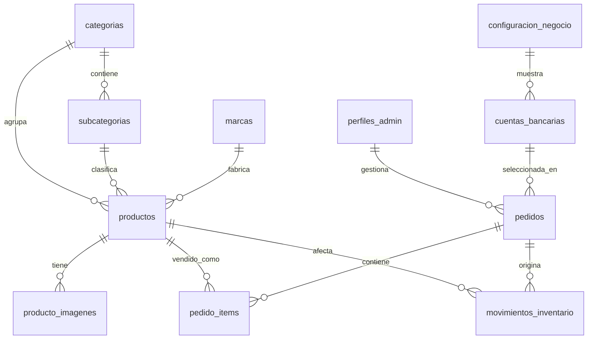

# Modelo de Base de Datos - Supabase

Este documento propone el modelo relacional para llevar Pesca Con Fe desde datos mock a un MVP operativo en Supabase. Todo el modelo usa nombres en espanol para tablas, columnas, vistas, funciones, enums e indices.

## Principios del Modelo

- La tienda publica solo lee productos, categorias, subcategorias, marcas, imagenes, cuentas bancarias y configuracion activa.
- El checkout crea pedidos en estado `pendiente_pago`.
- El cliente puede elegir `envio_servientrega` o `retiro_local`.
- Si elige `retiro_local`, el costo de envio debe ser `0.00`.
- El stock no baja al crear un pedido web.
- El stock baja solo cuando un administrador confirma el pago o registra una venta manual.
- El panel administrador requiere Supabase Auth y politicas RLS.
- Los totales del pedido se guardan como snapshot historico.
- Los datos importantes del producto tambien se copian en `pedido_items`, para que un pedido antiguo no cambie si luego se edita el producto.

## Entidades Principales



## Extensiones Recomendadas

```sql
create extension if not exists "pgcrypto";
create extension if not exists "citext";
```

`pgcrypto` permite usar `gen_random_uuid()`. `citext` permite guardar correos sin sensibilidad a mayusculas/minusculas.

## Tipos Enum

```sql
create type estado_pedido as enum (
  'pendiente_pago',
  'pagado_confirmado',
  'listo_retiro',
  'retirado',
  'enviado',
  'cancelado'
);

create type canal_venta as enum (
  'presencial',
  'whatsapp',
  'web'
);

create type tipo_entrega as enum (
  'envio_servientrega',
  'retiro_local'
);

create type tipo_cuenta_bancaria as enum (
  'Ahorro',
  'Corriente'
);

create type tipo_movimiento_inventario as enum (
  'venta_confirmada',
  'venta_manual',
  'ajuste_manual',
  'reposicion',
  'reversion_cancelacion'
);
```

## Tablas

### `perfiles_admin`

Extiende `auth.users` para saber que usuarios pueden entrar al panel administrador.

```sql
create table public.perfiles_admin (
  id uuid primary key references auth.users(id) on delete cascade,
  nombre_completo text not null,
  rol text not null default 'admin',
  activo boolean not null default true,
  creado_en timestamptz not null default now(),
  actualizado_en timestamptz not null default now()
);
```

Para el MVP puede existir solo el rol `admin`. Si luego se necesita mas control, usar roles como `dueno`, `admin` y `vendedor`.

### `configuracion_negocio`

Configuracion general de Pesca Con Fe. Normalmente habra una sola fila activa.

```sql
create table public.configuracion_negocio (
  id uuid primary key default gen_random_uuid(),
  nombre text not null,
  eslogan text,
  tipo_negocio text,
  direccion text not null,
  ciudad text not null,
  pais text not null default 'Ecuador',
  horario text,
  telefonos text[] not null default '{}',
  whatsapp_e164 text not null,
  correo citext,
  url_facebook text,
  url_instagram text,
  url_tiktok text,
  url_youtube text,
  url_whatsapp_perfil text,
  url_mapa_embed text,
  servicio_envio text not null default 'Servientrega Ecuador',
  costo_envio_base numeric(10,2) not null default 6.50,
  retiro_local_habilitado boolean not null default true,
  instrucciones_retiro text,
  activo boolean not null default true,
  creado_en timestamptz not null default now(),
  actualizado_en timestamptz not null default now()
);
```

### `cuentas_bancarias`

Cuentas que se muestran en el checkout.

```sql
create table public.cuentas_bancarias (
  id uuid primary key default gen_random_uuid(),
  configuracion_negocio_id uuid references public.configuracion_negocio(id) on delete set null,
  banco text not null,
  titular text not null,
  cedula text,
  tipo_cuenta tipo_cuenta_bancaria not null,
  numero_cuenta text not null,
  orden integer not null default 0,
  activa boolean not null default true,
  creado_en timestamptz not null default now(),
  actualizado_en timestamptz not null default now()
);
```

### `categorias`

Categorias publicas del catalogo: carrete, canas, indumentaria, senuelos.

```sql
create table public.categorias (
  id uuid primary key default gen_random_uuid(),
  nombre text not null,
  slug text not null unique,
  descripcion text,
  url_imagen text,
  orden integer not null default 0,
  activa boolean not null default true,
  creado_en timestamptz not null default now(),
  actualizado_en timestamptz not null default now()
);
```

### `subcategorias`

Subcategorias dependientes de una categoria.

```sql
create table public.subcategorias (
  id uuid primary key default gen_random_uuid(),
  categoria_id uuid not null references public.categorias(id) on delete cascade,
  nombre text not null,
  slug text not null,
  orden integer not null default 0,
  activa boolean not null default true,
  creado_en timestamptz not null default now(),
  actualizado_en timestamptz not null default now(),
  unique (categoria_id, slug)
);
```

### `marcas`

Marcas del catalogo.

```sql
create table public.marcas (
  id uuid primary key default gen_random_uuid(),
  nombre text not null unique,
  slug text not null unique,
  url_logo text,
  ancho_logo integer,
  alto_logo integer,
  orden integer not null default 0,
  activa boolean not null default true,
  creado_en timestamptz not null default now(),
  actualizado_en timestamptz not null default now()
);
```

### `productos`

Producto principal del catalogo.

```sql
create table public.productos (
  id uuid primary key default gen_random_uuid(),
  categoria_id uuid not null references public.categorias(id) on delete restrict,
  subcategoria_id uuid references public.subcategorias(id) on delete set null,
  marca_id uuid references public.marcas(id) on delete set null,
  slug text not null unique,
  nombre text not null,
  sku text not null unique,
  precio numeric(10,2) not null check (precio >= 0),
  stock integer not null default 0 check (stock >= 0),
  descripcion text not null,
  caracteristicas text[] not null default '{}',
  youtube_video_id text,
  destacado boolean not null default false,
  activo boolean not null default true,
  creado_en timestamptz not null default now(),
  actualizado_en timestamptz not null default now()
);
```

Campos como `imagen_principal`, `alt_imagen`, `categoria`, `marca` y `subcategoria` se derivan con joins desde `producto_imagenes`, `categorias`, `marcas` y `subcategorias`.

### `producto_imagenes`

Imagenes de productos. Puede usarse con Supabase Storage, Cloudinary o URLs externas.

```sql
create table public.producto_imagenes (
  id uuid primary key default gen_random_uuid(),
  producto_id uuid not null references public.productos(id) on delete cascade,
  url text not null,
  ruta_storage text,
  public_id text,
  alt text not null,
  orden integer not null default 0,
  principal boolean not null default false,
  creado_en timestamptz not null default now(),
  actualizado_en timestamptz not null default now()
);
```

Para asegurar solo una imagen principal por producto:

```sql
create unique index producto_imagenes_una_principal_por_producto
  on public.producto_imagenes(producto_id)
  where principal = true;
```

### `pedidos`

Pedido web, pedido por WhatsApp o venta presencial. Guarda datos del cliente, modalidad de entrega y totales como snapshot.

```sql
create table public.pedidos (
  id uuid primary key default gen_random_uuid(),
  codigo text not null unique,
  cliente_nombre_completo text not null,
  cliente_cedula text,
  cliente_celular text not null,
  cliente_correo citext,
  cliente_provincia text,
  cliente_ciudad text,
  cliente_direccion text,
  cliente_referencia_entrega text,
  tipo_entrega tipo_entrega not null default 'envio_servientrega',
  direccion_retiro_snapshot jsonb,
  cuenta_bancaria_id uuid references public.cuentas_bancarias(id) on delete set null,
  cuenta_bancaria_snapshot jsonb,
  subtotal numeric(10,2) not null check (subtotal >= 0),
  envio numeric(10,2) not null default 0 check (envio >= 0),
  total numeric(10,2) not null check (total >= 0),
  estado estado_pedido not null default 'pendiente_pago',
  canal canal_venta not null default 'web',
  pago_confirmado_en timestamptz,
  listo_retiro_en timestamptz,
  retirado_en timestamptz,
  enviado_en timestamptz,
  cancelado_en timestamptz,
  notas text,
  creado_por uuid references auth.users(id) on delete set null,
  confirmado_por uuid references auth.users(id) on delete set null,
  creado_en timestamptz not null default now(),
  actualizado_en timestamptz not null default now(),
  constraint pedidos_envio_requiere_direccion check (
    tipo_entrega <> 'envio_servientrega'
    or (
      cliente_provincia is not null
      and cliente_ciudad is not null
      and cliente_direccion is not null
    )
  ),
  constraint pedidos_retiro_sin_envio check (
    tipo_entrega <> 'retiro_local'
    or envio = 0
  ),
  constraint pedidos_retiro_requiere_snapshot check (
    tipo_entrega <> 'retiro_local'
    or direccion_retiro_snapshot is not null
  ),
  constraint pedidos_total_consistente check (
    total = subtotal + envio
  )
);
```

`cuenta_bancaria_snapshot` debe guardar banco, titular, tipo de cuenta y numero usado al crear el pedido.

`direccion_retiro_snapshot` debe guardar la direccion del local, horario, telefonos e instrucciones vigentes al momento de crear el pedido. Asi el pedido conserva la informacion aunque luego cambie la configuracion del negocio.

Para `retiro_local`, los campos de direccion del cliente pueden quedar vacios. Para `envio_servientrega`, provincia, ciudad y direccion son obligatorios.

### `pedido_items`

Lineas del pedido. Copian informacion basica del producto al momento de la compra.

```sql
create table public.pedido_items (
  id uuid primary key default gen_random_uuid(),
  pedido_id uuid not null references public.pedidos(id) on delete cascade,
  producto_id uuid references public.productos(id) on delete set null,
  producto_nombre text not null,
  producto_slug text not null,
  producto_sku text,
  producto_imagen text,
  categoria_slug text not null,
  precio numeric(10,2) not null check (precio >= 0),
  cantidad integer not null check (cantidad > 0),
  total_linea numeric(10,2) generated always as (precio * cantidad) stored,
  creado_en timestamptz not null default now()
);
```

### `movimientos_inventario`

Bitacora de cambios de stock. Sirve para auditar ventas manuales, confirmaciones de pago, reposiciones y ajustes.

```sql
create table public.movimientos_inventario (
  id uuid primary key default gen_random_uuid(),
  producto_id uuid not null references public.productos(id) on delete restrict,
  pedido_id uuid references public.pedidos(id) on delete set null,
  tipo tipo_movimiento_inventario not null,
  cantidad_delta integer not null,
  stock_antes integer not null check (stock_antes >= 0),
  stock_despues integer not null check (stock_despues >= 0),
  motivo text,
  creado_por uuid references auth.users(id) on delete set null,
  creado_en timestamptz not null default now()
);
```

Para ventas o pagos confirmados, `cantidad_delta` debe ser negativo. Para reposicion, positivo.

## Indices Recomendados

```sql
create index categorias_activas_orden_idx
  on public.categorias(activa, orden);

create index subcategorias_categoria_idx
  on public.subcategorias(categoria_id, activa, orden);

create index marcas_activas_orden_idx
  on public.marcas(activa, orden);

create index productos_catalogo_publico_idx
  on public.productos(activo, destacado, creado_en desc);

create index productos_categoria_idx
  on public.productos(categoria_id, subcategoria_id);

create index productos_marca_idx
  on public.productos(marca_id);

create index productos_stock_idx
  on public.productos(stock);

create index producto_imagenes_producto_orden_idx
  on public.producto_imagenes(producto_id, principal desc, orden);

create index pedidos_estado_creado_idx
  on public.pedidos(estado, creado_en desc);

create index pedidos_canal_creado_idx
  on public.pedidos(canal, creado_en desc);

create index pedidos_tipo_entrega_creado_idx
  on public.pedidos(tipo_entrega, creado_en desc);

create index pedidos_cliente_celular_idx
  on public.pedidos(cliente_celular);

create index pedido_items_pedido_idx
  on public.pedido_items(pedido_id);

create index movimientos_inventario_producto_creado_idx
  on public.movimientos_inventario(producto_id, creado_en desc);
```

## Vistas Utiles

### `productos_publicos`

Vista para reemplazar `mockProducts` en catalogo, home y detalle.

```sql
create view public.productos_publicos as
select
  p.id,
  p.slug,
  p.nombre,
  p.sku,
  m.nombre as marca,
  c.nombre as categoria,
  c.slug as categoria_slug,
  s.nombre as subcategoria,
  s.slug as subcategoria_slug,
  p.precio,
  p.stock,
  p.descripcion,
  p.caracteristicas,
  p.youtube_video_id,
  p.destacado,
  p.activo,
  p.creado_en,
  imagen_principal.url as imagen_principal,
  imagen_principal.alt as imagen_alt
from public.productos p
join public.categorias c on c.id = p.categoria_id
left join public.subcategorias s on s.id = p.subcategoria_id
left join public.marcas m on m.id = p.marca_id
left join lateral (
  select url, alt
  from public.producto_imagenes pi
  where pi.producto_id = p.id
  order by pi.principal desc, pi.orden asc, pi.creado_en asc
  limit 1
) imagen_principal on true
where p.activo = true;
```

### `pedidos_admin`

Vista practica para la tabla de ventas del panel administrador.

```sql
create view public.pedidos_admin as
select
  p.id,
  p.codigo,
  p.cliente_nombre_completo,
  p.cliente_celular,
  p.cliente_ciudad,
  p.estado,
  p.canal,
  p.tipo_entrega,
  p.subtotal,
  p.envio,
  p.total,
  p.creado_en,
  count(pi.id) as cantidad_lineas,
  coalesce(sum(pi.cantidad), 0) as cantidad_productos
from public.pedidos p
left join public.pedido_items pi on pi.pedido_id = p.id
group by p.id;
```

## Funciones Para Flujo Critico

### Calcular envio segun modalidad

La aplicacion puede calcular el envio, pero la base debe validar la regla principal:

- `envio_servientrega`: cobra segun categorias del carrito.
- `retiro_local`: siempre cobra `0.00`.

Para mayor seguridad, se puede crear una funcion auxiliar:

```sql
create or replace function public.calcular_envio_pedido(
  tipo_entrega_input tipo_entrega,
  costo_envio_calculado numeric
)
returns numeric
language sql
immutable
as $$
  select case
    when tipo_entrega_input = 'retiro_local' then 0
    else coalesce(costo_envio_calculado, 0)
  end;
$$;
```

En el frontend, el resumen del checkout debe mostrar dos opciones:

- `Envio por Servientrega`: pide provincia, ciudad, direccion y referencia; suma envio al total.
- `Retiro en local`: muestra direccion, horario, telefonos e instrucciones; no pide direccion de entrega; envio = `$0.00`.

### Generar codigo de pedido

```sql
create sequence if not exists public.pedido_codigo_seq start 1001;

create or replace function public.siguiente_codigo_pedido()
returns text
language sql
as $$
  select 'PCF-' || nextval('public.pedido_codigo_seq')::text;
$$;
```

### Confirmar pago y descontar stock

Esta funcion debe ejecutarse solo por administradores. Cambia el pedido a `pagado_confirmado`, descuenta stock y registra movimientos. Luego, segun el tipo de entrega, el administrador puede marcarlo como `enviado` o `listo_retiro`.

```sql
create or replace function public.confirmar_pago_pedido(pedido_id_input uuid)
returns void
language plpgsql
security definer
as $$
declare
  pedido_record public.pedidos%rowtype;
  item_record record;
  stock_actual integer;
  stock_nuevo integer;
begin
  select * into pedido_record
  from public.pedidos
  where id = pedido_id_input
  for update;

  if not found then
    raise exception 'Pedido no encontrado';
  end if;

  if pedido_record.estado <> 'pendiente_pago' then
    raise exception 'Solo se pueden confirmar pedidos pendientes de pago';
  end if;

  for item_record in
    select * from public.pedido_items where pedido_id = pedido_id_input
  loop
    select stock into stock_actual
    from public.productos
    where id = item_record.producto_id
    for update;

    if stock_actual is null then
      raise exception 'Producto no encontrado para el item %', item_record.id;
    end if;

    if stock_actual < item_record.cantidad then
      raise exception 'Stock insuficiente para el producto %', item_record.producto_nombre;
    end if;

    stock_nuevo := stock_actual - item_record.cantidad;

    update public.productos
    set stock = stock_nuevo,
        actualizado_en = now()
    where id = item_record.producto_id;

    insert into public.movimientos_inventario (
      producto_id,
      pedido_id,
      tipo,
      cantidad_delta,
      stock_antes,
      stock_despues,
      motivo,
      creado_por
    )
    values (
      item_record.producto_id,
      pedido_id_input,
      'venta_confirmada',
      item_record.cantidad * -1,
      stock_actual,
      stock_nuevo,
      'Pago confirmado',
      auth.uid()
    );
  end loop;

  update public.pedidos
  set estado = 'pagado_confirmado',
      pago_confirmado_en = now(),
      confirmado_por = auth.uid(),
      actualizado_en = now()
  where id = pedido_id_input;
end;
$$;
```

Nota: al usar `security definer`, hay que controlar permisos de ejecucion y validar que el usuario sea administrador.

### Marcar pedido listo para retiro

Solo aplica para pedidos pagados con `tipo_entrega = 'retiro_local'`.

```sql
create or replace function public.marcar_pedido_listo_retiro(pedido_id_input uuid)
returns void
language plpgsql
security definer
as $$
begin
  update public.pedidos
  set estado = 'listo_retiro',
      listo_retiro_en = now(),
      actualizado_en = now()
  where id = pedido_id_input
    and tipo_entrega = 'retiro_local'
    and estado = 'pagado_confirmado';

  if not found then
    raise exception 'El pedido no esta pagado o no es de retiro en local';
  end if;
end;
$$;
```

### Marcar pedido retirado

Solo aplica para pedidos en estado `listo_retiro`.

```sql
create or replace function public.marcar_pedido_retirado(pedido_id_input uuid)
returns void
language plpgsql
security definer
as $$
begin
  update public.pedidos
  set estado = 'retirado',
      retirado_en = now(),
      actualizado_en = now()
  where id = pedido_id_input
    and tipo_entrega = 'retiro_local'
    and estado = 'listo_retiro';

  if not found then
    raise exception 'El pedido no esta listo para retiro';
  end if;
end;
$$;
```

### Marcar pedido enviado

Solo aplica para pedidos pagados con `tipo_entrega = 'envio_servientrega'`.

```sql
create or replace function public.marcar_pedido_enviado(pedido_id_input uuid)
returns void
language plpgsql
security definer
as $$
begin
  update public.pedidos
  set estado = 'enviado',
      enviado_en = now(),
      actualizado_en = now()
  where id = pedido_id_input
    and tipo_entrega = 'envio_servientrega'
    and estado = 'pagado_confirmado';

  if not found then
    raise exception 'El pedido no esta pagado o no es de envio por Servientrega';
  end if;
end;
$$;
```

## RLS Sugerido

Activar RLS en todas las tablas del negocio:

```sql
alter table public.perfiles_admin enable row level security;
alter table public.configuracion_negocio enable row level security;
alter table public.cuentas_bancarias enable row level security;
alter table public.categorias enable row level security;
alter table public.subcategorias enable row level security;
alter table public.marcas enable row level security;
alter table public.productos enable row level security;
alter table public.producto_imagenes enable row level security;
alter table public.pedidos enable row level security;
alter table public.pedido_items enable row level security;
alter table public.movimientos_inventario enable row level security;
```

Funcion helper para saber si el usuario actual es admin:

```sql
create or replace function public.es_admin()
returns boolean
language sql
security definer
stable
as $$
  select exists (
    select 1
    from public.perfiles_admin
    where id = auth.uid()
      and activo = true
      and rol in ('dueno', 'admin', 'vendedor')
  );
$$;
```

Lectura publica para tienda:

```sql
create policy "Publico puede leer configuracion activa"
on public.configuracion_negocio for select
using (activo = true);

create policy "Publico puede leer cuentas bancarias activas"
on public.cuentas_bancarias for select
using (activa = true);

create policy "Publico puede leer categorias activas"
on public.categorias for select
using (activa = true);

create policy "Publico puede leer subcategorias activas"
on public.subcategorias for select
using (activa = true);

create policy "Publico puede leer marcas activas"
on public.marcas for select
using (activa = true);

create policy "Publico puede leer productos activos"
on public.productos for select
using (activo = true);

create policy "Publico puede leer imagenes de productos activos"
on public.producto_imagenes for select
using (
  exists (
    select 1
    from public.productos p
    where p.id = producto_imagenes.producto_id
      and p.activo = true
  )
);
```

Pedidos desde checkout anonimo:

```sql
create policy "Cualquiera puede crear pedidos web"
on public.pedidos for insert
with check (
  canal = 'web'
  and estado = 'pendiente_pago'
  and (
    (tipo_entrega = 'retiro_local' and envio = 0)
    or tipo_entrega = 'envio_servientrega'
  )
);

create policy "Cualquiera puede crear items de pedidos web"
on public.pedido_items for insert
with check (
  exists (
    select 1
    from public.pedidos p
    where p.id = pedido_items.pedido_id
      and p.canal = 'web'
      and p.estado = 'pendiente_pago'
  )
);
```

Administracion:

```sql
create policy "Admins gestionan configuracion"
on public.configuracion_negocio for all
using (public.es_admin())
with check (public.es_admin());

create policy "Admins gestionan cuentas bancarias"
on public.cuentas_bancarias for all
using (public.es_admin())
with check (public.es_admin());

create policy "Admins gestionan categorias"
on public.categorias for all
using (public.es_admin())
with check (public.es_admin());

create policy "Admins gestionan subcategorias"
on public.subcategorias for all
using (public.es_admin())
with check (public.es_admin());

create policy "Admins gestionan marcas"
on public.marcas for all
using (public.es_admin())
with check (public.es_admin());

create policy "Admins gestionan productos"
on public.productos for all
using (public.es_admin())
with check (public.es_admin());

create policy "Admins gestionan imagenes de productos"
on public.producto_imagenes for all
using (public.es_admin())
with check (public.es_admin());

create policy "Admins gestionan pedidos"
on public.pedidos for all
using (public.es_admin())
with check (public.es_admin());

create policy "Admins gestionan items de pedidos"
on public.pedido_items for all
using (public.es_admin())
with check (public.es_admin());

create policy "Admins leen movimientos de inventario"
on public.movimientos_inventario for select
using (public.es_admin());

create policy "Admins crean movimientos de inventario"
on public.movimientos_inventario for insert
with check (public.es_admin());
```

Recomendacion: no permitir cambios directos de `productos.stock` desde el cliente. Los cambios de stock deberian pasar por funciones controladas.

## Storage

Si se usa Supabase Storage:

- Bucket recomendado: `imagenes-productos`.
- Ruta sugerida: `productos/{producto_id}/{imagen_id}.webp`.
- Guardar la ruta en `producto_imagenes.ruta_storage`.
- Publico puede leer imagenes.
- Solo administradores pueden subir, actualizar o borrar.

Si se usa Cloudinary:

- Guardar URL final en `producto_imagenes.url`.
- Guardar `public_id` en `producto_imagenes.public_id`.
- No exponer secrets de Cloudinary en cliente.
- Subir imagenes desde Server Action o Route Handler.

## Implicaciones En Checkout Y WhatsApp

El checkout debe agregar un selector de modalidad de entrega:

- `Envio por Servientrega`
- `Retiro en local`

Cuando el cliente elige `envio_servientrega`:

- Se mantienen obligatorios provincia, ciudad y direccion.
- Se calcula envio segun categorias del carrito.
- El mensaje de WhatsApp debe incluir direccion de entrega, ciudad, provincia, referencia y costo de envio.

Cuando el cliente elige `retiro_local`:

- El envio debe ser `0.00`.
- No se debe exigir direccion de entrega.
- Se debe mostrar direccion del local, horario, telefonos e instrucciones de retiro.
- El mensaje de WhatsApp debe indicar que el pedido sera retirado en el local fisico.
- El pedido debe guardar `direccion_retiro_snapshot` con la informacion vigente del negocio.

Flujo recomendado para retiro local:

1. Cliente genera pedido con `tipo_entrega = 'retiro_local'` y `envio = 0`.
2. Cliente paga por transferencia o coordina por WhatsApp.
3. Admin confirma pago con `confirmar_pago_pedido()`.
4. Admin prepara el pedido y ejecuta `marcar_pedido_listo_retiro()`.
5. Cliente retira en el local.
6. Admin ejecuta `marcar_pedido_retirado()`.

Flujo recomendado para envio:

1. Cliente genera pedido con `tipo_entrega = 'envio_servientrega'`.
2. Cliente paga por transferencia.
3. Admin confirma pago con `confirmar_pago_pedido()`.
4. Admin despacha por Servientrega.
5. Admin ejecuta `marcar_pedido_enviado()`.

## Mapeo Desde El Codigo Actual

| Codigo actual | Tabla destino |
| --- | --- |
| `businessConfig` | `configuracion_negocio` |
| `bankAccounts` | `cuentas_bancarias` |
| `categories` | `categorias`, `subcategorias` |
| `brands`, `brandLogos` | `marcas` |
| `mockProducts` | `productos`, `producto_imagenes` |
| `mockOrders` | `pedidos`, `pedido_items` |
| `reduceStockForPaidOrder` | `confirmar_pago_pedido()` + `movimientos_inventario` |
| `calculateShipping` | `tipo_entrega`, `envio`, `calcular_envio_pedido()` |
| `ImageUploaderMock` | `producto_imagenes` + Storage/Cloudinary |
| `cart-store.ts` | Puede seguir en cliente; no requiere tabla para MVP |

## Orden Recomendado De Implementacion

1. Crear extensiones, enums, tablas e indices.
2. Crear funcion `es_admin()`.
3. Activar RLS y politicas iniciales.
4. Insertar configuracion del negocio y cuentas bancarias.
5. Insertar categorias, subcategorias y marcas.
6. Migrar productos e imagenes desde `mockProducts`.
7. Crear vistas `productos_publicos` y `pedidos_admin`.
8. Reemplazar catalogo y detalle para leer desde Supabase.
9. Implementar checkout real: permitir `envio_servientrega` o `retiro_local`, insertar `pedidos` y `pedido_items`, luego abrir WhatsApp.
10. Integrar Supabase Auth para `/admin`.
11. Crear perfiles en `perfiles_admin`.
12. Reemplazar tablas admin por CRUD real.
13. Implementar `confirmar_pago_pedido()` para descontar stock con auditoria.
14. Implementar acciones admin para `marcar_pedido_enviado()`, `marcar_pedido_listo_retiro()` y `marcar_pedido_retirado()`.
15. Reemplazar `ImageUploaderMock` por Supabase Storage o Cloudinary.
16. Agregar pruebas E2E del flujo de compra con envio, flujo de compra con retiro local y flujo admin.

## MVP Minimo De Base De Datos

Para lanzar rapido, estas tablas son suficientes:

- `perfiles_admin`
- `configuracion_negocio`
- `cuentas_bancarias`
- `categorias`
- `subcategorias`
- `marcas`
- `productos`
- `producto_imagenes`
- `pedidos`
- `pedido_items`
- `movimientos_inventario`

Con eso el proyecto puede operar ventas web por transferencia/WhatsApp, admin protegido, catalogo editable y control basico de stock.

## Pendientes Para Una Segunda Version

- Clientes con cuenta propia.
- Historial publico de pedidos por cliente.
- Cupones o descuentos.
- Promociones y banners editables.
- Multiples sucursales.
- Reportes diarios/mensuales.
- Facturacion electronica si el negocio la requiere.
- Integracion con pasarela de pago.
- Notificaciones automaticas por correo o WhatsApp Business API.
