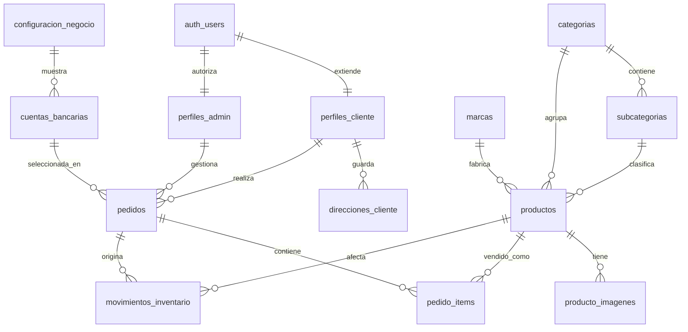

# Modelo de Base de Datos - Supabase + Cloudinary

Este documento define el modelo relacional recomendado para convertir Pesca Con Fe en un ecommerce operativo con Supabase, Supabase Auth, panel administrador, perfiles de cliente, checkout persistente y productos administrables con multiples imagenes en Cloudinary.

Todo el modelo usa nombres en espanol para tablas, columnas, vistas, funciones, enums e indices.

## Principios del Modelo

- Supabase Auth guarda la identidad del usuario.
- `perfiles_admin` decide quien puede entrar al panel administrador.
- `perfiles_cliente` guarda datos de cliente para autocompletar checkout.
- `direcciones_cliente` permite que la pestaña de direcciones exista sin redisenar la base despues.
- La tienda publica solo lee catalogo, imagenes, marcas, categorias, bancos y configuracion activos.
- El admin crea y edita productos desde el panel.
- Las imagenes de productos viven en Cloudinary; la base solo guarda metadatos, URLs y `public_id`.
- Un producto puede tener multiples imagenes y solo una imagen principal activa.
- El checkout puede crear pedidos anonimos o vinculados a un usuario autenticado.
- Los pedidos y sus items guardan snapshots historicos para que no cambien si luego se edita el catalogo.
- El stock no baja al crear un pedido web; baja cuando un administrador confirma pago o registra una venta manual.
- Las politicas RLS protegen escritura admin, datos de clientes y pedidos.

## Relacion General



`auth_users` representa `auth.users`; no se crea manualmente en `public`.

## 1. Extensiones

```sql
create extension if not exists "pgcrypto";
create extension if not exists "citext";
```

## 2. Enums

```sql
create type estado_pedido as enum (
  'pendiente_pago',
  'pagado_confirmado',
  'listo_retiro',
  'retirado',
  'enviado',
  'cancelado'
);

create type canal_venta as enum (
  'web',
  'whatsapp',
  'presencial'
);

create type tipo_entrega as enum (
  'envio_servientrega',
  'retiro_local'
);

create type tipo_cuenta_bancaria as enum (
  'Ahorro',
  'Corriente'
);

create type tipo_movimiento_inventario as enum (
  'venta_confirmada',
  'venta_manual',
  'ajuste_manual',
  'reposicion',
  'reversion_cancelacion'
);
```

## 3. Funciones Base

### Actualizar `actualizado_en`

```sql
create or replace function public.set_actualizado_en()
returns trigger
language plpgsql
as $$
begin
  new.actualizado_en = now();
  return new;
end;
$$;
```

### Validar cedula ecuatoriana

La aplicacion ya valida cedula en frontend, pero la base tambien puede proteger los datos.

```sql
create or replace function public.es_cedula_ecuatoriana(valor text)
returns boolean
language plpgsql
immutable
as $$
declare
  cedula text;
  provincia int;
  suma int := 0;
  digito int;
  coef int;
  i int;
begin
  cedula := regexp_replace(coalesce(valor, ''), '\D', '', 'g');

  if length(cedula) <> 10 then
    return false;
  end if;

  provincia := substring(cedula from 1 for 2)::int;
  if provincia < 1 or provincia > 24 then
    return false;
  end if;

  if substring(cedula from 3 for 1)::int > 6 then
    return false;
  end if;

  for i in 1..9 loop
    coef := case when i % 2 = 1 then 2 else 1 end;
    digito := substring(cedula from i for 1)::int * coef;
    if digito >= 10 then
      digito := digito - 9;
    end if;
    suma := suma + digito;
  end loop;

  return ((10 - (suma % 10)) % 10) = substring(cedula from 10 for 1)::int;
end;
$$;
```

### Codigo de pedido

Crear esta secuencia y funcion antes de crear `pedidos`, porque `pedidos.codigo` la usa como default.

```sql
create sequence if not exists public.pedido_codigo_seq start 1001;

create or replace function public.siguiente_codigo_pedido()
returns text
language sql
as $$
  select 'PCF-' || nextval('public.pedido_codigo_seq')::text;
$$;
```

## 4. Usuarios Y Permisos

### `perfiles_admin`

Autoriza el acceso al panel. Registrarse como cliente no concede acceso admin.

```sql
create table public.perfiles_admin (
  id uuid primary key references auth.users(id) on delete cascade,
  nombre_completo text not null,
  rol text not null default 'admin' check (rol in ('dueno', 'admin', 'vendedor')),
  activo boolean not null default true,
  creado_en timestamptz not null default now(),
  actualizado_en timestamptz not null default now()
);

create trigger perfiles_admin_actualizado_en
before update on public.perfiles_admin
for each row execute function public.set_actualizado_en();
```

### Helper admin

```sql
create or replace function public.es_admin()
returns boolean
language sql
security definer
stable
set search_path = public
as $$
  select exists (
    select 1
    from public.perfiles_admin
    where id = auth.uid()
      and activo = true
      and rol in ('dueno', 'admin', 'vendedor')
  );
$$;
```

### `perfiles_cliente`

Datos del usuario normal para autocompletar checkout y mostrar "Mi Cuenta".

```sql
create table public.perfiles_cliente (
  id uuid primary key references auth.users(id) on delete cascade,
  nombres text not null,
  apellidos text not null,
  nombre_completo text generated always as (trim(nombres || ' ' || apellidos)) stored,
  cedula text not null check (public.es_cedula_ecuatoriana(cedula)),
  celular text not null,
  correo citext not null,
  creado_en timestamptz not null default now(),
  actualizado_en timestamptz not null default now()
);

create unique index perfiles_cliente_cedula_unique
  on public.perfiles_cliente(cedula);

create unique index perfiles_cliente_correo_unique
  on public.perfiles_cliente(correo);

create trigger perfiles_cliente_actualizado_en
before update on public.perfiles_cliente
for each row execute function public.set_actualizado_en();
```

### `direcciones_cliente`

Direcciones guardadas por usuario para checkout. No reemplazan el snapshot del pedido.

```sql
create table public.direcciones_cliente (
  id uuid primary key default gen_random_uuid(),
  cliente_id uuid not null references auth.users(id) on delete cascade,
  alias text not null default 'Principal',
  provincia text not null,
  ciudad text not null,
  direccion text not null,
  referencia text,
  celular_contacto text,
  principal boolean not null default false,
  activa boolean not null default true,
  creado_en timestamptz not null default now(),
  actualizado_en timestamptz not null default now()
);

create unique index direcciones_cliente_una_principal_activa
  on public.direcciones_cliente(cliente_id)
  where principal = true and activa = true;

create index direcciones_cliente_cliente_idx
  on public.direcciones_cliente(cliente_id, activa, principal desc, creado_en desc);

create trigger direcciones_cliente_actualizado_en
before update on public.direcciones_cliente
for each row execute function public.set_actualizado_en();
```

## 5. Configuracion Del Negocio

### `configuracion_negocio`

Normalmente existira una sola fila activa.

```sql
create table public.configuracion_negocio (
  id uuid primary key default gen_random_uuid(),
  nombre text not null,
  eslogan text,
  tipo_negocio text,
  direccion text not null,
  ciudad text not null,
  pais text not null default 'Ecuador',
  horario text,
  telefonos text[] not null default '{}',
  whatsapp_e164 text not null,
  correo citext,
  url_facebook text,
  url_instagram text,
  url_tiktok text,
  url_youtube text,
  url_whatsapp_perfil text,
  url_mapa_embed text,
  servicio_envio text not null default 'Servientrega Ecuador',
  costo_envio_base numeric(10,2) not null default 6.50 check (costo_envio_base >= 0),
  retiro_local_habilitado boolean not null default true,
  instrucciones_retiro text,
  activo boolean not null default true,
  creado_en timestamptz not null default now(),
  actualizado_en timestamptz not null default now()
);

create trigger configuracion_negocio_actualizado_en
before update on public.configuracion_negocio
for each row execute function public.set_actualizado_en();
```

### `cuentas_bancarias`

Cuentas visibles en checkout.

```sql
create table public.cuentas_bancarias (
  id uuid primary key default gen_random_uuid(),
  configuracion_negocio_id uuid references public.configuracion_negocio(id) on delete set null,
  banco text not null,
  titular text not null,
  cedula text,
  tipo_cuenta tipo_cuenta_bancaria not null,
  numero_cuenta text not null,
  orden integer not null default 0,
  activa boolean not null default true,
  creado_en timestamptz not null default now(),
  actualizado_en timestamptz not null default now()
);

create trigger cuentas_bancarias_actualizado_en
before update on public.cuentas_bancarias
for each row execute function public.set_actualizado_en();
```

## 6. Catalogo

### `categorias`

```sql
create table public.categorias (
  id uuid primary key default gen_random_uuid(),
  nombre text not null,
  slug text not null unique,
  descripcion text,
  url_imagen text,
  orden integer not null default 0,
  activa boolean not null default true,
  creado_en timestamptz not null default now(),
  actualizado_en timestamptz not null default now()
);

create trigger categorias_actualizado_en
before update on public.categorias
for each row execute function public.set_actualizado_en();
```

### `subcategorias`

```sql
create table public.subcategorias (
  id uuid primary key default gen_random_uuid(),
  categoria_id uuid not null references public.categorias(id) on delete cascade,
  nombre text not null,
  slug text not null,
  orden integer not null default 0,
  activa boolean not null default true,
  creado_en timestamptz not null default now(),
  actualizado_en timestamptz not null default now(),
  unique (categoria_id, slug)
);

create trigger subcategorias_actualizado_en
before update on public.subcategorias
for each row execute function public.set_actualizado_en();
```

### `marcas`

```sql
create table public.marcas (
  id uuid primary key default gen_random_uuid(),
  nombre text not null unique,
  slug text not null unique,
  url_logo text,
  ancho_logo integer,
  alto_logo integer,
  orden integer not null default 0,
  activa boolean not null default true,
  creado_en timestamptz not null default now(),
  actualizado_en timestamptz not null default now()
);

create trigger marcas_actualizado_en
before update on public.marcas
for each row execute function public.set_actualizado_en();
```

### `productos`

Cada fila representa un SKU vendible. Las variantes se pueden agregar despues si el negocio las necesita.

```sql
create table public.productos (
  id uuid primary key default gen_random_uuid(),
  categoria_id uuid not null references public.categorias(id) on delete restrict,
  subcategoria_id uuid references public.subcategorias(id) on delete set null,
  marca_id uuid references public.marcas(id) on delete set null,
  slug text not null unique,
  nombre text not null,
  sku text not null unique,
  precio numeric(10,2) not null check (precio >= 0),
  stock integer not null default 0 check (stock >= 0),
  descripcion text not null,
  caracteristicas text[] not null default '{}',
  youtube_video_id text,
  destacado boolean not null default false,
  activo boolean not null default true,
  creado_por uuid references auth.users(id) on delete set null,
  actualizado_por uuid references auth.users(id) on delete set null,
  creado_en timestamptz not null default now(),
  actualizado_en timestamptz not null default now()
);

create trigger productos_actualizado_en
before update on public.productos
for each row execute function public.set_actualizado_en();
```

### `producto_imagenes`

Metadatos de imagenes subidas a Cloudinary. La base no guarda `api_secret`, upload presets privados ni credenciales.

```sql
create table public.producto_imagenes (
  id uuid primary key default gen_random_uuid(),
  producto_id uuid not null references public.productos(id) on delete cascade,
  cloudinary_public_id text not null,
  cloudinary_secure_url text not null,
  cloudinary_url text,
  cloudinary_version bigint,
  cloudinary_signature text,
  cloudinary_format text,
  cloudinary_resource_type text not null default 'image',
  cloudinary_width integer,
  cloudinary_height integer,
  cloudinary_bytes integer,
  alt text not null,
  orden integer not null default 0,
  principal boolean not null default false,
  activo boolean not null default true,
  creado_por uuid references auth.users(id) on delete set null,
  actualizado_por uuid references auth.users(id) on delete set null,
  creado_en timestamptz not null default now(),
  actualizado_en timestamptz not null default now(),
  unique (cloudinary_public_id)
);

create unique index producto_imagenes_una_principal_activa
  on public.producto_imagenes(producto_id)
  where principal = true and activo = true;

create index producto_imagenes_producto_orden_idx
  on public.producto_imagenes(producto_id, principal desc, orden, creado_en);

create trigger producto_imagenes_actualizado_en
before update on public.producto_imagenes
for each row execute function public.set_actualizado_en();
```

Recomendacion para subida desde el panel:

- El cliente selecciona multiples archivos.
- Un Server Action o Route Handler firma/sube a Cloudinary con variables privadas.
- Por cada resultado exitoso se inserta una fila en `producto_imagenes`.
- Si una imagen se marca como principal, primero se desmarca la anterior del mismo producto.
- Al borrar una imagen, conviene eliminarla en Cloudinary y luego desactivarla o borrarla en Supabase.

## 7. Pedidos

### `pedidos`

Soporta pedidos anonimos, pedidos de usuarios logueados, ventas manuales y pedidos por WhatsApp.

```sql
create table public.pedidos (
  id uuid primary key default gen_random_uuid(),
  codigo text not null unique default public.siguiente_codigo_pedido(),
  cliente_id uuid references auth.users(id) on delete set null,
  cliente_nombre_completo text not null,
  cliente_cedula text,
  cliente_celular text not null,
  cliente_correo citext,
  cliente_provincia text,
  cliente_ciudad text,
  cliente_direccion text,
  cliente_referencia_entrega text,
  direccion_cliente_id uuid references public.direcciones_cliente(id) on delete set null,
  tipo_entrega tipo_entrega not null default 'envio_servientrega',
  direccion_retiro_snapshot jsonb,
  cuenta_bancaria_id uuid references public.cuentas_bancarias(id) on delete set null,
  cuenta_bancaria_snapshot jsonb,
  subtotal numeric(10,2) not null check (subtotal >= 0),
  envio numeric(10,2) not null default 0 check (envio >= 0),
  total numeric(10,2) not null check (total >= 0),
  estado estado_pedido not null default 'pendiente_pago',
  canal canal_venta not null default 'web',
  pago_confirmado_en timestamptz,
  listo_retiro_en timestamptz,
  retirado_en timestamptz,
  enviado_en timestamptz,
  cancelado_en timestamptz,
  notas text,
  creado_por uuid references auth.users(id) on delete set null,
  confirmado_por uuid references auth.users(id) on delete set null,
  creado_en timestamptz not null default now(),
  actualizado_en timestamptz not null default now(),
  constraint pedidos_envio_requiere_direccion check (
    tipo_entrega <> 'envio_servientrega'
    or (
      cliente_provincia is not null
      and cliente_ciudad is not null
      and cliente_direccion is not null
    )
  ),
  constraint pedidos_retiro_sin_envio check (
    tipo_entrega <> 'retiro_local'
    or envio = 0
  ),
  constraint pedidos_retiro_requiere_snapshot check (
    tipo_entrega <> 'retiro_local'
    or direccion_retiro_snapshot is not null
  ),
  constraint pedidos_total_consistente check (
    total = subtotal + envio
  )
);

create trigger pedidos_actualizado_en
before update on public.pedidos
for each row execute function public.set_actualizado_en();
```

`cuenta_bancaria_snapshot` debe guardar banco, titular, tipo de cuenta y numero usado al crear el pedido.

`direccion_retiro_snapshot` debe guardar direccion del local, horario, telefonos e instrucciones vigentes.

### `pedido_items`

Guarda snapshot de producto, precio e imagen principal al momento de compra.

```sql
create table public.pedido_items (
  id uuid primary key default gen_random_uuid(),
  pedido_id uuid not null references public.pedidos(id) on delete cascade,
  producto_id uuid references public.productos(id) on delete set null,
  producto_nombre text not null,
  producto_slug text not null,
  producto_sku text,
  producto_imagen text,
  categoria_slug text not null,
  precio numeric(10,2) not null check (precio >= 0),
  cantidad integer not null check (cantidad > 0),
  total_linea numeric(10,2) generated always as (precio * cantidad) stored,
  creado_en timestamptz not null default now()
);
```

### `movimientos_inventario`

Bitacora auditable de cambios de stock.

```sql
create table public.movimientos_inventario (
  id uuid primary key default gen_random_uuid(),
  producto_id uuid not null references public.productos(id) on delete restrict,
  pedido_id uuid references public.pedidos(id) on delete set null,
  tipo tipo_movimiento_inventario not null,
  cantidad_delta integer not null,
  stock_antes integer not null check (stock_antes >= 0),
  stock_despues integer not null check (stock_despues >= 0),
  motivo text,
  creado_por uuid references auth.users(id) on delete set null,
  creado_en timestamptz not null default now()
);
```

## 8. Funciones De Pedido

### Crear pedido web

El checkout usa una RPC `security definer` para crear el pedido y sus items en una sola transaccion, incluso cuando el cliente no ha iniciado sesion. La definicion completa vive en `docs/supabase_pesca_con_fe_base.sql` y el parche aplicable en proyectos existentes vive en `docs/supabase_allow_anonymous_checkout_orders.sql`.

### Confirmar pago y descontar stock

```sql
create or replace function public.confirmar_pago_pedido(pedido_id_input uuid)
returns void
language plpgsql
security definer
set search_path = public
as $$
declare
  pedido_record public.pedidos%rowtype;
  item_record record;
  stock_actual integer;
  stock_nuevo integer;
begin
  if not public.es_admin() then
    raise exception 'No autorizado';
  end if;

  select * into pedido_record
  from public.pedidos
  where id = pedido_id_input
  for update;

  if not found then
    raise exception 'Pedido no encontrado';
  end if;

  if pedido_record.estado <> 'pendiente_pago' then
    raise exception 'Solo se pueden confirmar pedidos pendientes de pago';
  end if;

  for item_record in
    select * from public.pedido_items where pedido_id = pedido_id_input
  loop
    select stock into stock_actual
    from public.productos
    where id = item_record.producto_id
    for update;

    if stock_actual is null then
      raise exception 'Producto no encontrado para el item %', item_record.id;
    end if;

    if stock_actual < item_record.cantidad then
      raise exception 'Stock insuficiente para %', item_record.producto_nombre;
    end if;

    stock_nuevo := stock_actual - item_record.cantidad;

    update public.productos
    set stock = stock_nuevo,
        actualizado_por = auth.uid(),
        actualizado_en = now()
    where id = item_record.producto_id;

    insert into public.movimientos_inventario (
      producto_id,
      pedido_id,
      tipo,
      cantidad_delta,
      stock_antes,
      stock_despues,
      motivo,
      creado_por
    )
    values (
      item_record.producto_id,
      pedido_id_input,
      'venta_confirmada',
      item_record.cantidad * -1,
      stock_actual,
      stock_nuevo,
      'Pago confirmado',
      auth.uid()
    );
  end loop;

  update public.pedidos
  set estado = 'pagado_confirmado',
      pago_confirmado_en = now(),
      confirmado_por = auth.uid(),
      actualizado_en = now()
  where id = pedido_id_input;
end;
$$;
```

### Cambios de estado

```sql
create or replace function public.marcar_pedido_listo_retiro(pedido_id_input uuid)
returns void
language plpgsql
security definer
set search_path = public
as $$
begin
  if not public.es_admin() then
    raise exception 'No autorizado';
  end if;

  update public.pedidos
  set estado = 'listo_retiro',
      listo_retiro_en = now(),
      actualizado_en = now()
  where id = pedido_id_input
    and tipo_entrega = 'retiro_local'
    and estado = 'pagado_confirmado';

  if not found then
    raise exception 'El pedido no esta pagado o no es de retiro local';
  end if;
end;
$$;

create or replace function public.marcar_pedido_retirado(pedido_id_input uuid)
returns void
language plpgsql
security definer
set search_path = public
as $$
begin
  if not public.es_admin() then
    raise exception 'No autorizado';
  end if;

  update public.pedidos
  set estado = 'retirado',
      retirado_en = now(),
      actualizado_en = now()
  where id = pedido_id_input
    and tipo_entrega = 'retiro_local'
    and estado = 'listo_retiro';

  if not found then
    raise exception 'El pedido no esta listo para retiro';
  end if;
end;
$$;

create or replace function public.marcar_pedido_enviado(pedido_id_input uuid)
returns void
language plpgsql
security definer
set search_path = public
as $$
begin
  if not public.es_admin() then
    raise exception 'No autorizado';
  end if;

  update public.pedidos
  set estado = 'enviado',
      enviado_en = now(),
      actualizado_en = now()
  where id = pedido_id_input
    and tipo_entrega = 'envio_servientrega'
    and estado = 'pagado_confirmado';

  if not found then
    raise exception 'El pedido no esta pagado o no es de envio';
  end if;
end;
$$;
```

### Cancelar pedido

```sql
create or replace function public.cancelar_pedido(pedido_id_input uuid)
returns void
language plpgsql
security definer
set search_path = public
as $$
declare
  pedido_record public.pedidos%rowtype;
  item_record record;
  stock_actual integer;
  stock_nuevo integer;
begin
  if not public.es_admin() then
    raise exception 'No autorizado';
  end if;

  select * into pedido_record
  from public.pedidos
  where id = pedido_id_input
  for update;

  if not found then
    raise exception 'Pedido no encontrado';
  end if;

  if pedido_record.estado in ('enviado', 'retirado', 'cancelado') then
    raise exception 'Este pedido no se puede cancelar';
  end if;

  if pedido_record.estado in ('pagado_confirmado', 'listo_retiro') then
    for item_record in
      select * from public.pedido_items where pedido_id = pedido_id_input
    loop
      select stock into stock_actual
      from public.productos
      where id = item_record.producto_id
      for update;

      if stock_actual is not null then
        stock_nuevo := stock_actual + item_record.cantidad;

        update public.productos
        set stock = stock_nuevo,
            actualizado_por = auth.uid(),
            actualizado_en = now()
        where id = item_record.producto_id;

        insert into public.movimientos_inventario (
          producto_id,
          pedido_id,
          tipo,
          cantidad_delta,
          stock_antes,
          stock_despues,
          motivo,
          creado_por
        )
        values (
          item_record.producto_id,
          pedido_id_input,
          'reversion_cancelacion',
          item_record.cantidad,
          stock_actual,
          stock_nuevo,
          'Pedido cancelado',
          auth.uid()
        );
      end if;
    end loop;
  end if;

  update public.pedidos
  set estado = 'cancelado',
      cancelado_en = now(),
      actualizado_en = now()
  where id = pedido_id_input;
end;
$$;
```

## 9. Indices

```sql
create index categorias_activas_orden_idx
  on public.categorias(activa, orden);

create index subcategorias_categoria_idx
  on public.subcategorias(categoria_id, activa, orden);

create index marcas_activas_orden_idx
  on public.marcas(activa, orden);

create index productos_catalogo_publico_idx
  on public.productos(activo, destacado, creado_en desc);

create index productos_categoria_idx
  on public.productos(categoria_id, subcategoria_id);

create index productos_marca_idx
  on public.productos(marca_id);

create index productos_stock_idx
  on public.productos(stock);

create index pedidos_cliente_creado_idx
  on public.pedidos(cliente_id, creado_en desc);

create index pedidos_estado_creado_idx
  on public.pedidos(estado, creado_en desc);

create index pedidos_canal_creado_idx
  on public.pedidos(canal, creado_en desc);

create index pedidos_tipo_entrega_creado_idx
  on public.pedidos(tipo_entrega, creado_en desc);

create index pedidos_cliente_celular_idx
  on public.pedidos(cliente_celular);

create index pedido_items_pedido_idx
  on public.pedido_items(pedido_id);

create index movimientos_inventario_producto_creado_idx
  on public.movimientos_inventario(producto_id, creado_en desc);
```

## 10. Vistas

### `productos_publicos`

Vista para home, catalogo y detalle.

```sql
create or replace view public.productos_publicos
with (security_invoker = true) as
select
  p.id,
  p.slug,
  p.nombre,
  p.sku,
  m.nombre as marca,
  c.nombre as categoria,
  c.slug as categoria_slug,
  s.nombre as subcategoria,
  s.slug as subcategoria_slug,
  p.precio,
  p.stock,
  p.descripcion,
  p.caracteristicas,
  p.youtube_video_id,
  p.destacado,
  p.activo,
  p.creado_en,
  imagen_principal.cloudinary_secure_url as imagen_principal,
  imagen_principal.alt as imagen_alt
from public.productos p
join public.categorias c on c.id = p.categoria_id
left join public.subcategorias s on s.id = p.subcategoria_id
left join public.marcas m on m.id = p.marca_id
left join lateral (
  select cloudinary_secure_url, alt
  from public.producto_imagenes pi
  where pi.producto_id = p.id
    and pi.activo = true
  order by pi.principal desc, pi.orden asc, pi.creado_en asc
  limit 1
) imagen_principal on true
where p.activo = true;
```

### `productos_admin`

```sql
create or replace view public.productos_admin
with (security_invoker = true) as
select
  p.id,
  p.slug,
  p.nombre,
  p.sku,
  p.precio,
  p.stock,
  p.destacado,
  p.activo,
  c.nombre as categoria,
  s.nombre as subcategoria,
  m.nombre as marca,
  count(pi.id) filter (where pi.activo = true) as cantidad_imagenes,
  bool_or(pi.principal and pi.activo) as tiene_imagen_principal,
  p.creado_en,
  p.actualizado_en
from public.productos p
join public.categorias c on c.id = p.categoria_id
left join public.subcategorias s on s.id = p.subcategoria_id
left join public.marcas m on m.id = p.marca_id
left join public.producto_imagenes pi on pi.producto_id = p.id
group by p.id, c.nombre, s.nombre, m.nombre;
```

### `pedidos_admin`

```sql
create or replace view public.pedidos_admin
with (security_invoker = true) as
select
  p.id,
  p.codigo,
  p.cliente_id,
  p.cliente_nombre_completo,
  p.cliente_celular,
  p.cliente_ciudad,
  p.estado,
  p.canal,
  p.tipo_entrega,
  p.subtotal,
  p.envio,
  p.total,
  p.creado_en,
  count(pi.id) as cantidad_lineas,
  coalesce(sum(pi.cantidad), 0) as cantidad_productos
from public.pedidos p
left join public.pedido_items pi on pi.pedido_id = p.id
group by p.id;
```

### `mis_pedidos`

```sql
create or replace view public.mis_pedidos
with (security_invoker = true) as
select
  p.id,
  p.codigo,
  p.estado,
  p.tipo_entrega,
  p.subtotal,
  p.envio,
  p.total,
  p.creado_en,
  p.cliente_id,
  count(pi.id) as cantidad_lineas,
  coalesce(sum(pi.cantidad), 0) as cantidad_productos
from public.pedidos p
left join public.pedido_items pi on pi.pedido_id = p.id
where p.cliente_id = auth.uid()
group by p.id;
```

## 11. RLS

La funcion `public.es_admin()` ya fue creada en la seccion de usuarios y permisos, antes de las funciones de pedido y antes de activar RLS.

### Activar RLS

```sql
alter table public.perfiles_admin enable row level security;
alter table public.perfiles_cliente enable row level security;
alter table public.direcciones_cliente enable row level security;
alter table public.configuracion_negocio enable row level security;
alter table public.cuentas_bancarias enable row level security;
alter table public.categorias enable row level security;
alter table public.subcategorias enable row level security;
alter table public.marcas enable row level security;
alter table public.productos enable row level security;
alter table public.producto_imagenes enable row level security;
alter table public.pedidos enable row level security;
alter table public.pedido_items enable row level security;
alter table public.movimientos_inventario enable row level security;

revoke all on function public.crear_pedido_web(jsonb) from public;
grant execute on function public.crear_pedido_web(jsonb) to anon, authenticated;
```

### Lectura publica

```sql
create policy "Publico puede leer configuracion activa"
on public.configuracion_negocio for select
using (activo = true);

create policy "Publico puede leer cuentas bancarias activas"
on public.cuentas_bancarias for select
using (activa = true);

create policy "Publico puede leer categorias activas"
on public.categorias for select
using (activa = true);

create policy "Publico puede leer subcategorias activas"
on public.subcategorias for select
using (activa = true);

create policy "Publico puede leer marcas activas"
on public.marcas for select
using (activa = true);

create policy "Publico puede leer productos activos"
on public.productos for select
using (activo = true);

create policy "Publico puede leer imagenes activas de productos activos"
on public.producto_imagenes for select
using (
  activo = true
  and exists (
    select 1
    from public.productos p
    where p.id = producto_imagenes.producto_id
      and p.activo = true
  )
);
```

### Cliente autenticado

```sql
create policy "Clientes leen su perfil"
on public.perfiles_cliente for select
using (id = auth.uid());

create policy "Clientes crean su perfil"
on public.perfiles_cliente for insert
with check (id = auth.uid());

create policy "Clientes actualizan su perfil"
on public.perfiles_cliente for update
using (id = auth.uid())
with check (id = auth.uid());

create policy "Clientes gestionan sus direcciones"
on public.direcciones_cliente for all
using (cliente_id = auth.uid())
with check (cliente_id = auth.uid());

create policy "Clientes leen sus pedidos"
on public.pedidos for select
using (cliente_id = auth.uid());

create policy "Clientes leen items de sus pedidos"
on public.pedido_items for select
using (
  exists (
    select 1
    from public.pedidos p
    where p.id = pedido_items.pedido_id
      and p.cliente_id = auth.uid()
  )
);
```

### Checkout web

```sql
grant execute on function public.crear_pedido_web(jsonb) to anon, authenticated;
```

### Administracion

```sql
create policy "Admins leen perfiles admin"
on public.perfiles_admin for select
using (public.es_admin());

create policy "Admins gestionan perfiles cliente"
on public.perfiles_cliente for all
using (public.es_admin())
with check (public.es_admin());

create policy "Admins gestionan direcciones cliente"
on public.direcciones_cliente for all
using (public.es_admin())
with check (public.es_admin());

create policy "Admins gestionan configuracion"
on public.configuracion_negocio for all
using (public.es_admin())
with check (public.es_admin());

create policy "Admins gestionan cuentas bancarias"
on public.cuentas_bancarias for all
using (public.es_admin())
with check (public.es_admin());

create policy "Admins gestionan categorias"
on public.categorias for all
using (public.es_admin())
with check (public.es_admin());

create policy "Admins gestionan subcategorias"
on public.subcategorias for all
using (public.es_admin())
with check (public.es_admin());

create policy "Admins gestionan marcas"
on public.marcas for all
using (public.es_admin())
with check (public.es_admin());

create policy "Admins gestionan productos"
on public.productos for all
using (public.es_admin())
with check (public.es_admin());

create policy "Admins gestionan imagenes de productos"
on public.producto_imagenes for all
using (public.es_admin())
with check (public.es_admin());

create policy "Admins gestionan pedidos"
on public.pedidos for all
using (public.es_admin())
with check (public.es_admin());

create policy "Admins gestionan items de pedidos"
on public.pedido_items for all
using (public.es_admin())
with check (public.es_admin());

create policy "Admins leen movimientos de inventario"
on public.movimientos_inventario for select
using (public.es_admin());

create policy "Admins crean movimientos de inventario"
on public.movimientos_inventario for insert
with check (public.es_admin());
```

## 12. Sincronizacion Desde Auth Metadata

`perfiles_cliente` debe crearse automaticamente al registrar un usuario. Esto evita depender de una sesion activa en el navegador, porque Supabase puede crear el usuario en `auth.users` y exigir confirmacion por correo sin entregar `data.session`.

```sql
create or replace function public.crear_perfil_cliente_desde_auth()
returns trigger
language plpgsql
security definer
set search_path = public
as $$
begin
  insert into public.perfiles_cliente (
    id,
    nombres,
    apellidos,
    cedula,
    celular,
    correo
  )
  values (
    new.id,
    new.raw_user_meta_data->>'first_name',
    new.raw_user_meta_data->>'last_name',
    new.raw_user_meta_data->>'cedula',
    new.raw_user_meta_data->>'phone',
    new.email
  )
  on conflict (id) do update
  set nombres = excluded.nombres,
      apellidos = excluded.apellidos,
      cedula = excluded.cedula,
      celular = excluded.celular,
      correo = excluded.correo;

  return new;
end;
$$;

drop trigger if exists crear_perfil_cliente_al_registrarse on auth.users;

create trigger crear_perfil_cliente_al_registrarse
after insert on auth.users
for each row execute function public.crear_perfil_cliente_desde_auth();
```

En proyectos existentes, aplicar `docs/supabase_create_customer_profile_on_signup.sql`.

## 13. Cloudinary

Variables privadas esperadas en servidor:

```txt
CLOUDINARY_CLOUD_NAME=
CLOUDINARY_API_KEY=
CLOUDINARY_API_SECRET=
```

Reglas de integracion:

- No guardar `CLOUDINARY_API_SECRET` en Supabase.
- No exponer secretos en componentes cliente.
- Subir imagenes desde Server Action o Route Handler.
- Guardar en `producto_imagenes` cada respuesta exitosa de Cloudinary.
- Usar `cloudinary_secure_url` para renderizar imagenes.
- Usar `cloudinary_public_id` para reemplazar o eliminar imagenes.
- Para multiples imagenes, mantener `orden` y `principal`.

## 14. Mapeo Desde El Codigo Actual

| Codigo actual | Tabla destino |
| --- | --- |
| `businessConfig` | `configuracion_negocio` |
| `bankAccounts` | `cuentas_bancarias` |
| `categories` | `categorias`, `subcategorias` |
| `brands`, `brandLogos` | `marcas` |
| `mockProducts` | `productos`, `producto_imagenes` |
| `ImageUploaderMock` | Cloudinary + `producto_imagenes` |
| `mockOrders` | `pedidos`, `pedido_items` |
| `reduceStockForPaidOrder` | `confirmar_pago_pedido()` + `movimientos_inventario` |
| `calculateShipping` | `tipo_entrega`, `envio` |
| Supabase Auth metadata | `perfiles_cliente` |
| `/mi-cuenta?seccion=direcciones` | `direcciones_cliente` |

## 15. Orden Recomendado De Implementacion

1. Crear extensiones.
2. Crear enums.
3. Crear `set_actualizado_en()`, `es_cedula_ecuatoriana()` y `siguiente_codigo_pedido()`.
4. Crear `perfiles_admin` y luego `es_admin()`.
5. Crear el resto de tablas en este orden: perfiles de cliente, direcciones, configuracion, catalogo, imagenes, pedidos, items, inventario.
6. Crear triggers de `actualizado_en`.
7. Crear indices.
8. Activar RLS y politicas.
9. Crear vistas con `security_invoker = true`.
10. Insertar configuracion del negocio y cuentas bancarias.
11. Insertar categorias, subcategorias y marcas.
12. Migrar productos mock e imagenes a Cloudinary.
13. Conectar catalogo publico a `productos_publicos`.
14. Conectar checkout a `pedidos` y `pedido_items`.
15. Conectar `/mi-cuenta` a `perfiles_cliente`, `direcciones_cliente` y `mis_pedidos`.
16. Reemplazar CRUD mock del admin por operaciones reales.
17. Implementar subida multiple a Cloudinary desde el panel admin.
18. Implementar confirmacion de pago y cambios de estado.

## 16. MVP Minimo

Para operar el ecommerce real sin extras, estas tablas son suficientes:

- `perfiles_admin`
- `perfiles_cliente`
- `direcciones_cliente`
- `configuracion_negocio`
- `cuentas_bancarias`
- `categorias`
- `subcategorias`
- `marcas`
- `productos`
- `producto_imagenes`
- `pedidos`
- `pedido_items`
- `movimientos_inventario`

## 17. Pendientes Para Versiones Futuras

- Variantes de producto por talla, color o modelo.
- Cupones y promociones.
- Favoritos.
- Multiples sucursales.
- Reportes avanzados.
- Facturacion electronica.
- Pasarela de pago.
- Notificaciones automaticas por correo o WhatsApp Business API.
- Auditoria detallada de cambios admin.
